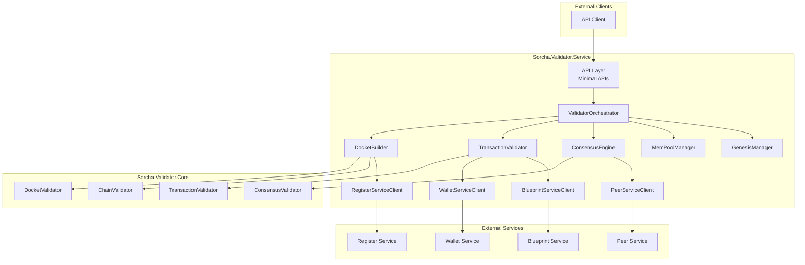

# Sorcha Validator Service - Technical Specification

## Document Information

| Field | Value |
|-------|-------|
| **Service Name** | Sorcha Validator Service |
| **Version** | 1.0 |
| **Status** | Specification |
| **Date** | 2025-11-16 |
| **Author** | Claude Code (Anthropic) |
| **Related Docs** | `/docs/validator-service-design.md` |

---

## Table of Contents

1. [Executive Summary](#1-executive-summary)
2. [Background and Context](#2-background-and-context)
3. [Requirements](#3-requirements)
4. [Architecture](#4-architecture)
5. [Component Specifications](#5-component-specifications)
6. [API Specifications](#6-api-specifications)
7. [Data Models](#7-data-models)
8. [Security Specifications](#8-security-specifications)
9. [Deployment Specifications](#9-deployment-specifications)
10. [Testing Specifications](#10-testing-specifications)
11. [Operational Specifications](#11-operational-specifications)
12. [Success Criteria](#12-success-criteria)

---

## 1. Executive Summary

The Sorcha Validator Service is the **blockchain consensus and validation component** of the Sorcha platform. It implements the distributed ledger consensus mechanism, building and validating Dockets (blocks) that contain Transactions from Blueprint Action executions.

**Key Capabilities:**
- **Docket Building** - Assembles Transactions into cryptographically-linked blocks
- **Validation Engine** - Verifies signatures, schemas, and chain integrity
- **Consensus Coordination** - Implements distributed consensus across Peer networks
- **Genesis Management** - Creates first blocks for new Registers
- **Enclave Support** - Designed for secure execution in Intel SGX/AMD SEV/HSMs
- **Operational Control** - Admin APIs for metrics, monitoring, and lifecycle management

**Strategic Importance:**
The Validator Service is the **trust anchor** of Sorcha, ensuring:
- Data integrity through cryptographic hashing
- Authentication through signature verification
- Consensus through distributed validation
- Immutability through blockchain chaining

---

## 2. Background and Context

### 2.1 Purpose

Sorcha requires a blockchain consensus mechanism to:
1. **Validate Transactions** - Ensure all Blueprint Action executions are valid
2. **Build Immutable Ledger** - Create tamper-proof audit trail
3. **Coordinate Peers** - Achieve distributed consensus across network
4. **Protect Integrity** - Prevent double-spending, replay attacks, and data tampering

### 2.2 Functional Basis (SiccaV3 Analysis)

The design is based on analysis of the SiccaV3 Validator Service with improvements:

**Adopted from SiccaV3:**
- ✅ 4-layer architecture (API → Service → Core → Tests)
- ✅ Event-driven design (adapted for Sorcha patterns)
- ✅ Thread-safe MemPool with per-Register isolation
- ✅ Genesis block handling
- ✅ SHA256 blockchain hashing
- ✅ JWT authentication with RBAC

**Improvements over SiccaV3:**
- ✅ **Proper consensus mechanism** (SiccaV3 had non-functional stub)
- ✅ **Full transaction validation** (signature verification, state validation)
- ✅ **Chain integrity enforcement** (SiccaV3 used placeholder hashes)
- ✅ **MemPool limits** (SiccaV3 was unbounded with no expiration)
- ✅ **Recovery mechanisms** (fork detection, rollback, chain recovery)
- ✅ **Rate limiting and security hardening**
- ✅ **Enclave-compatible core library** (pure .NET, no I/O)

### 2.3 Design Principles

**Sorcha Architectural Patterns:**
1. **Minimal APIs** - ASP.NET Core Minimal APIs (not Controllers)
2. **Service Defaults** - Standard health checks, telemetry, service discovery
3. **Portable Core** - Validation logic in library (can run in enclaves)
4. **Dependency Injection** - All services injected via DI
5. **Async/Await** - Fully asynchronous throughout
6. **OpenAPI Documentation** - All endpoints documented
7. **.NET Aspire** - Cloud-native orchestration

**Security-First Design:**
- **No private keys in Validator** - Delegated to Wallet Service
- **Enclave-safe core** - Pure validation logic can run in secure enclaves
- **Input validation** - All inputs sanitized before processing
- **Rate limiting** - Protection against DoS attacks
- **Audit logging** - Comprehensive security event tracking

---

## 3. Requirements

### 3.1 Functional Requirements

| ID | Requirement | Priority | Source |
|----|-------------|----------|--------|
| FR-001 | Build Dockets from MemPool Transactions | Must Have | Core functionality |
| FR-002 | Validate incoming Dockets from Peers | Must Have | Core functionality |
| FR-003 | Verify Transaction signatures via Wallet Service | Must Have | Security |
| FR-004 | Validate Transaction payload against Blueprint schemas | Must Have | Data integrity |
| FR-005 | Compute and verify SHA256 Docket hashes | Must Have | Chain integrity |
| FR-006 | Verify PreviousHash linkage for chain integrity | Must Have | Blockchain |
| FR-007 | Create genesis blocks for new Registers | Must Have | Register initialization |
| FR-008 | Implement distributed consensus (quorum-based) | Must Have | Multi-Peer validation |
| FR-009 | Manage per-Register MemPools with size limits | Must Have | Resource management |
| FR-010 | Support admin APIs for start/stop/pause/resume | Must Have | Operations |
| FR-011 | Expose metrics for Docket building and validation | Must Have | Observability |
| FR-012 | Handle Transaction expiration in MemPool | Should Have | Cleanup |
| FR-013 | Support enclave execution (SGX/SEV/HSM) | Should Have | Production security |
| FR-014 | Validate Disclosure rules for privacy | Should Have | Privacy |
| FR-015 | Support custom validation rules (pluggable) | Could Have | Extensibility |

### 3.2 Non-Functional Requirements

| ID | Requirement | Target | Priority |
|----|-------------|--------|----------|
| NFR-001 | Docket build time | < 5 seconds (100 tx) | Must Have |
| NFR-002 | Docket validation time | < 2 seconds (100 tx) | Must Have |
| NFR-003 | Consensus coordination time | < 30 seconds (3 validators) | Must Have |
| NFR-004 | MemPool throughput | > 1000 tx/second | Should Have |
| NFR-005 | API latency (P95) | < 500ms | Should Have |
| NFR-006 | API latency (P99) | < 1000ms | Could Have |
| NFR-007 | Concurrent validation operations | 10+ simultaneous | Should Have |
| NFR-008 | Test coverage (Core) | > 90% | Must Have |
| NFR-009 | Test coverage (Service) | > 70% | Should Have |
| NFR-010 | Uptime | 99.9% | Should Have |

### 3.3 Security Requirements

| ID | Requirement | Priority |
|----|-------------|----------|
| SEC-001 | All Transaction signatures verified via Wallet Service | Must Have |
| SEC-002 | Rate limiting on all public endpoints | Must Have |
| SEC-003 | Input validation prevents injection attacks | Must Have |
| SEC-004 | Audit logging for all critical operations | Must Have |
| SEC-005 | No private keys stored in Validator Service | Must Have |
| SEC-006 | JWT authentication with role-based access control | Should Have |
| SEC-007 | Enclave attestation for production deployments | Should Have |
| SEC-008 | Protection against replay attacks | Should Have |
| SEC-009 | Protection against double-spending | Should Have |
| SEC-010 | TLS encryption for all service-to-service calls | Should Have |

### 3.4 Integration Requirements

| Service | Purpose | Priority |
|---------|---------|----------|
| Wallet Service | Signature verification, key management | Must Have |
| Peer Service | Docket broadcasting, consensus coordination | Must Have |
| Register Service | Blockchain storage, chain queries | Must Have |
| Blueprint Service | Blueprint/schema retrieval for validation | Must Have |
| Redis | Distributed caching, pub/sub messaging | Should Have |

---

## 4. Architecture

### 4.1 Layered Architecture

```
┌─────────────────────────────────────────────────────────────┐
│                 Sorcha.Validator.Service                    │
│                    (ASP.NET Core 10.0)                      │
├─────────────────────────────────────────────────────────────┤
│                                                               │
│  Layer 1: API Layer (Minimal APIs)                          │
│  ┌──────────────────────────────────────────────────────┐  │
│  │ • ValidationEndpoints.cs                             │  │
│  │ • AdminEndpoints.cs                                  │  │
│  │ • MetricsEndpoints.cs                                │  │
│  │ • Middleware (Auth, Rate Limiting, Error Handling)   │  │
│  └──────────────────────────────────────────────────────┘  │
│                           ↓                                  │
│  Layer 2: Service Orchestration                             │
│  ┌──────────────────────────────────────────────────────┐  │
│  │ ValidatorOrchestrator                                │  │
│  │ ├─ DocketBuilder                                     │  │
│  │ ├─ TransactionValidator                              │  │
│  │ ├─ ConsensusEngine                                   │  │
│  │ ├─ MemPoolManager                                    │  │
│  │ └─ GenesisManager                                    │  │
│  └──────────────────────────────────────────────────────┘  │
│                           ↓                                  │
│  Layer 3: External Service Clients                          │
│  ┌──────────────────────────────────────────────────────┐  │
│  │ • WalletServiceClient (HTTP)                         │  │
│  │ • PeerServiceClient (HTTP)                           │  │
│  │ • RegisterServiceClient (HTTP)                       │  │
│  │ • BlueprintServiceClient (HTTP)                      │  │
│  └──────────────────────────────────────────────────────┘  │
│                                                               │
└─────────────────────────────────────────────────────────────┘

┌─────────────────────────────────────────────────────────────┐
│              Sorcha.Validator.Core (Library)                │
│           (Enclave-Safe, Pure .NET, No I/O)                 │
├─────────────────────────────────────────────────────────────┤
│                                                               │
│  Pure Validation Logic (Static Methods)                     │
│  ┌──────────────────────────────────────────────────────┐  │
│  │ • DocketValidator.ValidateDocket()                   │  │
│  │ • DocketValidator.ComputeDocketHash()                │  │
│  │ • TransactionValidator.ValidateTransaction()         │  │
│  │ • TransactionValidator.ValidateAgainstSchemas()      │  │
│  │ • ConsensusValidator.ValidateConsensusVote()         │  │
│  │ • ChainValidator.ValidateChainIntegrity()            │  │
│  └──────────────────────────────────────────────────────┘  │
│                                                               │
│  Characteristics:                                            │
│  ✓ No I/O (all data passed as parameters)                  │
│  ✓ No network (no HttpClient, no database)                 │
│  ✓ Stateless (no mutable state)                            │
│  ✓ Deterministic (same input = same output)                │
│  ✓ Thread-safe (can run in parallel)                       │
│  ✓ Enclave-compatible (Intel SGX, AMD SEV, HSM)           │
│                                                               │
└─────────────────────────────────────────────────────────────┘
```

### 4.2 Project Structure

```
src/
├── Services/
│   └── Sorcha.Validator.Service/
│       ├── Program.cs                      # Entry point, DI setup
│       ├── appsettings.json               # Configuration
│       ├── Endpoints/
│       │   ├── ValidationEndpoints.cs     # Validation APIs
│       │   ├── AdminEndpoints.cs          # Admin APIs
│       │   └── MetricsEndpoints.cs        # Metrics APIs
│       ├── Services/
│       │   ├── IValidatorOrchestrator.cs
│       │   ├── ValidatorOrchestrator.cs
│       │   ├── IDocketBuilder.cs
│       │   ├── DocketBuilder.cs
│       │   ├── ITransactionValidator.cs
│       │   ├── TransactionValidator.cs
│       │   ├── IConsensusEngine.cs
│       │   ├── ConsensusEngine.cs
│       │   ├── IMemPoolManager.cs
│       │   ├── MemPoolManager.cs
│       │   ├── IGenesisManager.cs
│       │   └── GenesisManager.cs
│       ├── Clients/
│       │   ├── WalletServiceClient.cs
│       │   ├── PeerServiceClient.cs
│       │   ├── RegisterServiceClient.cs
│       │   └── BlueprintServiceClient.cs
│       ├── Models/
│       │   ├── Docket.cs
│       │   ├── Transaction.cs
│       │   ├── ConsensusVote.cs
│       │   ├── GenesisConfig.cs
│       │   ├── ValidationResult.cs
│       │   ├── DocketBuildResult.cs
│       │   ├── ConsensusResult.cs
│       │   └── MemPoolStats.cs
│       ├── Configuration/
│       │   ├── ValidatorServiceConfiguration.cs
│       │   ├── ConsensusConfiguration.cs
│       │   └── SecurityConfiguration.cs
│       └── Middleware/
│           ├── RateLimitingMiddleware.cs
│           └── ErrorHandlingMiddleware.cs
│
└── Common/
    └── Sorcha.Validator.Core/
        ├── Validators/
        │   ├── DocketValidator.cs
        │   ├── TransactionValidator.cs
        │   ├── ConsensusValidator.cs
        │   └── ChainValidator.cs
        ├── Models/
        │   ├── ValidationResult.cs
        │   ├── ValidationError.cs
        │   └── ValidationRules.cs
        └── Cryptography/
            └── HashingUtilities.cs

tests/
├── Sorcha.Validator.Core.Tests/
│   ├── DocketValidatorTests.cs
│   ├── TransactionValidatorTests.cs
│   ├── ConsensusValidatorTests.cs
│   └── ChainValidatorTests.cs
└── Sorcha.Validator.Service.Tests/
    ├── Integration/
    │   ├── DocketBuildingTests.cs
    │   ├── ValidationEndpointsTests.cs
    │   ├── ConsensusTests.cs
    │   └── AdminEndpointsTests.cs
    └── Unit/
        ├── DocketBuilderTests.cs
        ├── TransactionValidatorTests.cs
        ├── ConsensusEngineTests.cs
        └── MemPoolManagerTests.cs
```

### 4.3 Component Diagram



---

## 5. Component Specifications

### 5.1 ValidatorOrchestrator

**Responsibility:** Coordinates all validation operations and manages lifecycle.

**Interface:**
```csharp
public interface IValidatorOrchestrator
{
    // Lifecycle management
    Task StartValidationAsync(string registerId, CancellationToken ct = default);
    Task StopValidationAsync(string registerId, CancellationToken ct = default);
    Task PauseValidationAsync(string registerId, CancellationToken ct = default);
    Task ResumeValidationAsync(string registerId, CancellationToken ct = default);

    // Status queries
    Task<ValidationStatus> GetStatusAsync(string registerId, CancellationToken ct = default);
    Task<IEnumerable<RegisterValidationState>> GetAllStatusesAsync(CancellationToken ct = default);
}

public class ValidationStatus
{
    public string RegisterId { get; init; } = string.Empty;
    public ValidatorState State { get; init; } = ValidatorState.Stopped;
    public int LastDocketNumber { get; init; }
    public int MemPoolSize { get; init; }
    public TimeSpan Uptime { get; init; }
    public int DocketsBuilt { get; init; }
    public int TransactionsProcessed { get; init; }
}

public enum ValidatorState
{
    Stopped,
    Starting,
    Running,
    Pausing,
    Paused,
    Stopping,
    Error
}
```

**Implementation Notes:**
- Uses `BackgroundService` for continuous validation loop
- Maintains `ConcurrentDictionary<string, RegisterValidationState>` for per-Register state
- Coordinates between `DocketBuilder`, `ConsensusEngine`, and `MemPoolManager`
- Handles errors and retries with exponential backoff
- Publishes events (Docket built, validation completed, consensus achieved)

### 5.2 DocketBuilder

**Responsibility:** Builds Dockets from MemPool Transactions.

**Interface:**
```csharp
public interface IDocketBuilder
{
    Task<DocketBuildResult> BuildDocketAsync(
        string registerId,
        string validatorWalletAddress,
        CancellationToken ct = default);

    Task<Docket> CreateGenesisBlockAsync(
        string registerId,
        string creatorWalletAddress,
        GenesisConfig config,
        CancellationToken ct = default);
}
```

**Algorithm (BuildDocketAsync):**
```
1. Get pending Transactions from MemPool (up to MaxTransactionsPerDocket)
2. Validate each Transaction:
   a. Verify signature (via Wallet Service)
   b. Validate payload against Blueprint schema (via Blueprint Service)
   c. Check Transaction is not expired
   d. Check Transaction is not duplicate
3. Collect valid Transactions (reject invalid)
4. Get previous Docket from Register Service
5. Create new Docket:
   a. DocketNumber = previousDocket.DocketNumber + 1
   b. PreviousHash = previousDocket.Hash
   c. Timestamp = DateTimeOffset.UtcNow
   d. ValidatorAddress = validatorWalletAddress
   e. Transactions = validTransactions
6. Compute Docket hash (using DocketValidator.ComputeDocketHash)
7. Validate Docket integrity (using DocketValidator.ValidateDocket)
8. Return DocketBuildResult
```

**Configuration:**
- `MaxTransactionsPerDocket` (default: 100)
- `MaxDocketSizeBytes` (default: 1 MB)
- `DocketBuildInterval` (default: 10 seconds)

### 5.3 TransactionValidator

**Responsibility:** Validates individual Transactions.

**Interface:**
```csharp
public interface ITransactionValidator
{
    Task<TransactionValidationResult> ValidateAsync(
        Transaction transaction,
        ValidationContext context,
        CancellationToken ct = default);

    Task<IEnumerable<TransactionValidationResult>> ValidateBatchAsync(
        IEnumerable<Transaction> transactions,
        ValidationContext context,
        CancellationToken ct = default);
}

public class ValidationContext
{
    public string RegisterId { get; init; } = string.Empty;
    public Blueprint? Blueprint { get; init; }
    public Action? Action { get; init; }
    public string? PreviousTxHash { get; init; }
    public bool RequireSignatureVerification { get; init; } = true;
}
```

**Validation Steps:**
```
1. Basic structure validation:
   - TxId not null/empty
   - RegisterId matches context
   - BlueprintId not null/empty
   - SenderAddress valid format
   - Timestamp within acceptable range

2. Blueprint/Action validation:
   - Blueprint exists (query Blueprint Service)
   - Action exists in Blueprint
   - Sender authorized for Action

3. Payload validation:
   - Validate against JSON Schema (Action.DataSchemas)
   - Check required fields present
   - Validate data types

4. Signature verification:
   - Verify signature via Wallet Service
   - Check signature covers all critical fields

5. Business rule validation:
   - Not duplicate (check MemPool and Register)
   - Not expired (based on TransactionExpirationTime)
   - Previous transaction valid (if chained)

6. Privacy validation:
   - Disclosure rules applied correctly
   - Selective data disclosure validated
```

### 5.4 ConsensusEngine

**Responsibility:** Coordinates distributed consensus across validators.

**Interface:**
```csharp
public interface IConsensusEngine
{
    Task<ConsensusResult> AchieveConsensusAsync(
        Docket docket,
        IEnumerable<string> validatorAddresses,
        CancellationToken ct = default);

    Task<bool> ValidateConsensusVoteAsync(
        ConsensusVote vote,
        Docket docket,
        CancellationToken ct = default);
}
```

**Simple Quorum Algorithm:**
```
1. Broadcast Docket to all validators (via Peer Service)
2. Each validator:
   a. Validates Docket independently
   b. Signs vote (approve/reject) via Wallet Service
   c. Returns ConsensusVote
3. Collect votes (with timeout)
4. Check quorum:
   - totalVotes >= MinimumValidators
   - approvedVotes / totalVotes >= QuorumPercentage
5. If quorum achieved:
   - Attach votes to Docket
   - Mark Docket as ConsensusState.Approved
   - Return ConsensusResult.Achieved
6. If quorum failed:
   - Mark Docket as ConsensusState.Rejected
   - Return ConsensusResult.Failed
```

**Configuration:**
- `ConsensusType` (default: SimpleQuorum)
- `QuorumPercentage` (default: 0.67 = 2-of-3)
- `MinimumValidators` (default: 1)
- `VoteTimeout` (default: 30 seconds)

### 5.5 MemPoolManager

**Responsibility:** Manages per-Register Transaction pools.

**Interface:**
```csharp
public interface IMemPoolManager
{
    Task<bool> AddTransactionAsync(
        string registerId,
        Transaction transaction,
        CancellationToken ct = default);

    Task<IEnumerable<Transaction>> GetPendingTransactionsAsync(
        string registerId,
        int maxCount,
        CancellationToken ct = default);

    Task RemoveTransactionsAsync(
        string registerId,
        IEnumerable<string> transactionIds,
        CancellationToken ct = default);

    Task<MemPoolStats> GetStatsAsync(string registerId, CancellationToken ct = default);

    Task CleanupExpiredTransactionsAsync(string registerId, CancellationToken ct = default);
}

public class MemPoolStats
{
    public string RegisterId { get; init; } = string.Empty;
    public int TotalTransactions { get; init; }
    public int PendingTransactions { get; init; }
    public int ExpiredTransactions { get; init; }
    public long SizeBytes { get; init; }
    public DateTimeOffset OldestTransactionTime { get; init; }
}
```

**Implementation Details:**
- Uses `ConcurrentDictionary<string, ConcurrentQueue<Transaction>>` per Register
- Thread-safe operations
- Size limits enforced (MaxMemPoolSizePerRegister)
- Automatic expiration based on TransactionExpirationTime
- FIFO ordering (oldest Transactions processed first)
- Background cleanup task removes expired Transactions

**Configuration:**
- `MaxMemPoolSizePerRegister` (default: 10,000)
- `TransactionExpirationTime` (default: 24 hours)

### 5.6 GenesisManager

**Responsibility:** Creates genesis blocks for new Registers.

**Interface:**
```csharp
public interface IGenesisManager
{
    Task<Docket> CreateGenesisBlockAsync(
        GenesisConfig config,
        CancellationToken ct = default);

    Task<bool> IsGenesisValidAsync(
        Docket docket,
        CancellationToken ct = default);
}
```

**Genesis Creation Algorithm:**
```
1. Validate GenesisConfig:
   - RegisterId not null/empty
   - RegisterName not null/empty
   - CreatorAddress valid
   - InitialValidators not empty

2. Create genesis Docket:
   - RegisterId = config.RegisterId
   - DocketNumber = 0
   - PreviousHash = "0000000000000000000000000000000000000000000000000000000000000000"
   - Timestamp = DateTimeOffset.UtcNow
   - ValidatorAddress = config.CreatorAddress
   - Transactions = [] (empty for genesis)
   - IsGenesis = true
   - GenesisConfig = JSON.Serialize(config)

3. Compute hash:
   - Hash = DocketValidator.ComputeDocketHash(docket)

4. Store to Register Service

5. Return genesis Docket
```

---

## 6. API Specifications

### 6.1 Validation Endpoints

**Base Path:** `/api/validation`

#### 6.1.1 POST /api/validation/dockets/build

Build new Docket from MemPool.

**Request Body:**
```json
{
  "registerId": "reg_abc123",
  "validatorWalletAddress": "0x1234...abcd",
  "maxTransactions": 100
}
```

**Response (200 OK):**
```json
{
  "isSuccess": true,
  "docket": {
    "registerId": "reg_abc123",
    "docketNumber": 42,
    "hash": "a3b5c7d9e1f3...",
    "previousHash": "d8e9f1a2b3c4...",
    "timestamp": "2025-11-16T10:30:00Z",
    "validatorAddress": "0x1234...abcd",
    "transactions": [...],
    "isGenesis": false,
    "consensusVotes": [],
    "consensusState": "Pending"
  },
  "metrics": {
    "transactionsProcessed": 150,
    "transactionsIncluded": 100,
    "transactionsRejected": 50,
    "buildDuration": "00:00:02.5",
    "docketSizeBytes": 524288
  },
  "errors": []
}
```

**Error Response (400 Bad Request):**
```json
{
  "isSuccess": false,
  "docket": null,
  "metrics": null,
  "errors": [
    "No pending transactions in MemPool",
    "Validator wallet address invalid"
  ]
}
```

**OpenAPI Metadata:**
```csharp
.WithName("BuildDocket")
.WithSummary("Build new Docket from MemPool")
.WithDescription("Collects pending Transactions from MemPool, validates them, and builds a new Docket")
.WithTags("Validation")
.Produces<DocketBuildResult>(200)
.Produces<DocketBuildResult>(400)
.RequireAuthorization("Validator")
```

#### 6.1.2 POST /api/validation/dockets/validate

Validate incoming Docket from Peer.

**Request Body:**
```json
{
  "docket": {
    "registerId": "reg_abc123",
    "docketNumber": 42,
    "hash": "a3b5c7...",
    "previousHash": "d8e9f1...",
    "timestamp": "2025-11-16T10:30:00Z",
    "validatorAddress": "0x5678...efgh",
    "transactions": [...]
  }
}
```

**Response (200 OK):**
```json
{
  "isValid": true,
  "errors": [],
  "validationDuration": "00:00:01.2",
  "checksPerformed": [
    "StructureValidation",
    "HashVerification",
    "ChainIntegrity",
    "SignatureVerification",
    "SchemaValidation"
  ]
}
```

**Error Response (400 Bad Request):**
```json
{
  "isValid": false,
  "errors": [
    {
      "code": "HASH_MISMATCH",
      "message": "Docket hash does not match computed hash",
      "severity": "Critical"
    },
    {
      "code": "SIGNATURE_INVALID",
      "message": "Transaction signature verification failed",
      "field": "transactions[3].signature",
      "severity": "Critical"
    }
  ],
  "validationDuration": "00:00:00.8",
  "checksPerformed": [
    "StructureValidation",
    "HashVerification"
  ]
}
```

#### 6.1.3 POST /api/validation/transactions/add

Add Transaction to MemPool.

**Request Body:**
```json
{
  "transaction": {
    "txId": "tx_xyz789",
    "registerId": "reg_abc123",
    "blueprintId": "bp_456",
    "actionId": 2,
    "senderAddress": "0x1234...abcd",
    "targetAddress": "0x5678...efgh",
    "payload": {
      "field1": "value1",
      "field2": 42
    },
    "timestamp": "2025-11-16T10:25:00Z",
    "signature": "abc123def456...",
    "previousTxId": null,
    "metadata": {}
  }
}
```

**Response (200 OK):**
```json
{
  "accepted": true,
  "memPoolSize": 42,
  "estimatedInclusionTime": "00:00:08",
  "message": "Transaction added to MemPool successfully"
}
```

**Error Response (400 Bad Request):**
```json
{
  "accepted": false,
  "memPoolSize": 10000,
  "estimatedInclusionTime": null,
  "message": "MemPool full for Register reg_abc123"
}
```

#### 6.1.4 POST /api/validation/genesis

Create genesis block.

**Request Body:**
```json
{
  "registerId": "reg_new123",
  "registerName": "Supply Chain Register",
  "description": "Tracks supply chain Blueprint executions",
  "creatorAddress": "0x1234...abcd",
  "initialValidators": [
    "0x1234...abcd",
    "0x5678...efgh",
    "0x9abc...ijkl"
  ],
  "initialState": {
    "chainId": "sorcha-main",
    "version": "1.0"
  },
  "consensusConfig": {
    "type": "SimpleQuorum",
    "quorumPercentage": 0.67,
    "minimumValidators": 2,
    "voteTimeout": "00:00:30"
  }
}
```

**Response (201 Created):**
```json
{
  "docket": {
    "registerId": "reg_new123",
    "docketNumber": 0,
    "hash": "genesis_a3b5c7...",
    "previousHash": "0000000000000000000000000000000000000000000000000000000000000000",
    "timestamp": "2025-11-16T10:00:00Z",
    "validatorAddress": "0x1234...abcd",
    "transactions": [],
    "isGenesis": true,
    "genesisConfig": "{...}",
    "consensusVotes": [],
    "consensusState": "Approved"
  },
  "message": "Genesis block created successfully"
}
```

### 6.2 Admin Endpoints

**Base Path:** `/api/admin/validation`

#### 6.2.1 POST /api/admin/validation/start/{registerId}

Start validation for Register.

**Response (200 OK):**
```json
{
  "registerId": "reg_abc123",
  "status": "Running",
  "message": "Validation started successfully",
  "timestamp": "2025-11-16T10:00:00Z"
}
```

#### 6.2.2 POST /api/admin/validation/stop/{registerId}

Stop validation for Register.

#### 6.2.3 POST /api/admin/validation/pause/{registerId}

Pause validation temporarily.

#### 6.2.4 POST /api/admin/validation/resume/{registerId}

Resume paused validation.

#### 6.2.5 GET /api/admin/validation/status

Get status for all Registers.

**Response (200 OK):**
```json
{
  "registers": [
    {
      "registerId": "reg_abc123",
      "status": "Running",
      "lastDocketNumber": 42,
      "memPoolSize": 15,
      "uptime": "02:30:45",
      "docketsBuilt": 42,
      "transactionsProcessed": 1250,
      "lastDocketTimestamp": "2025-11-16T10:29:00Z"
    }
  ],
  "totalRegisters": 1,
  "activeValidators": 3
}
```

### 6.3 Metrics Endpoints

**Base Path:** `/api/metrics`

#### 6.3.1 GET /api/metrics/dockets

Get Docket metrics.

**Response (200 OK):**
```json
{
  "totalDocketsBuilt": 125,
  "totalDocketsValidated": 450,
  "averageBuildTime": "00:00:02.3",
  "averageValidationTime": "00:00:01.1",
  "averageTransactionsPerDocket": 87.5,
  "consensusSuccessRate": 0.98,
  "last24Hours": {
    "docketsBuilt": 42,
    "docketsValidated": 156,
    "averageBuildTime": "00:00:02.1"
  }
}
```

#### 6.3.2 GET /api/metrics/transactions

Get Transaction metrics.

#### 6.3.3 GET /api/metrics/consensus

Get consensus metrics.

#### 6.3.4 GET /api/metrics/mempool

Get MemPool metrics.

---

## 7. Data Models

### 7.1 Core Models

See `/docs/validator-service-design.md` Section 3 for complete data model specifications.

**Key Models:**
- `Docket` - Blockchain block
- `Transaction` - Action execution record
- `ConsensusVote` - Validator vote
- `GenesisConfig` - Genesis block configuration

### 7.2 Configuration Models

- `ValidatorServiceConfiguration` - Main service config
- `ConsensusConfiguration` - Consensus settings
- `SecurityConfiguration` - Security settings

### 7.3 Result Models

- `DocketBuildResult` - Docket building result
- `TransactionValidationResult` - Transaction validation result
- `ConsensusResult` - Consensus outcome
- `ValidationResult` - Generic validation result

---

## 8. Security Specifications

### 8.1 Authentication & Authorization

**Authentication:**
- JWT Bearer tokens (issued by Auth Service)
- Service-to-service authentication via API keys

**Authorization (RBAC):**
- `Validator` role - Can build Dockets, vote on consensus
- `Admin` role - Can start/stop validation, change config
- `ReadOnly` role - Can query metrics, status

**Endpoint Authorization:**
| Endpoint | Required Role |
|----------|---------------|
| POST /api/validation/dockets/build | Validator |
| POST /api/validation/dockets/validate | Validator |
| POST /api/validation/transactions/add | Authenticated |
| POST /api/validation/genesis | Admin |
| POST /api/admin/* | Admin |
| GET /api/metrics/* | ReadOnly |

### 8.2 Enclave Support Specifications

**Development Environment:**
- No enclave
- Direct calls to `Sorcha.Validator.Core`

**Production Environment (Intel SGX):**
- Compile `Sorcha.Validator.Core` as SGX enclave
- Remote attestation required
- Encrypted memory for validation operations
- No I/O inside enclave (all data passed in/out)

**Production Environment (Azure Confidential Computing):**
- Deploy on Azure DC-series VMs (AMD SEV-SNP)
- Confidential VM with encrypted memory
- Attestation via Azure Attestation Service

**Production Environment (HSM):**
- Deploy validation logic to HSM
- Use PKCS#11 or similar interface
- Cryptographic operations hardware-accelerated

### 8.3 Input Validation

**All inputs validated:**
- RegisterId: alphanumeric, max 100 chars
- WalletAddress: hex string, 40 chars (0x prefix optional)
- TxId: UUID format or custom ID format
- Payload: max 1 MB JSON
- Signature: hex string, specific length based on algorithm

**Sanitization:**
- HTML encoding for all string inputs
- JSON schema validation for complex objects
- SQL injection prevention (parameterized queries)

### 8.4 Rate Limiting

**Limits:**
- `/api/validation/transactions/add`: 1000/minute per IP
- `/api/validation/dockets/build`: 100/minute per validator
- `/api/validation/dockets/validate`: 500/minute per validator
- `/api/admin/*`: 100/minute per user
- `/api/metrics/*`: 1000/minute per IP

**Implementation:**
- ASP.NET Core Rate Limiting middleware
- Partitioned by IP address or user identity
- Fixed window algorithm

---

## 9. Deployment Specifications

### 9.1 Environment Variables

| Variable | Description | Default |
|----------|-------------|---------|
| `ASPNETCORE_ENVIRONMENT` | Environment (Development/Production) | Development |
| `ASPNETCORE_URLS` | Listening URLs | http://+:8080 |
| `VALIDATOR_ENABLED` | Enable validation | true |
| `WALLET_SERVICE_URL` | Wallet Service URL | http://wallet-service |
| `PEER_SERVICE_URL` | Peer Service URL | http://peer-service |
| `REGISTER_SERVICE_URL` | Register Service URL | http://register-service |
| `BLUEPRINT_SERVICE_URL` | Blueprint Service URL | http://blueprint-service |
| `REDIS_CONNECTION` | Redis connection string | localhost:6379 |

### 9.2 Docker Compose

```yaml
version: '3.8'

services:
  validator-service:
    image: sorcha-validator-service:latest
    build:
      context: .
      dockerfile: src/Services/Sorcha.Validator.Service/Dockerfile
    ports:
      - "8080:8080"
    environment:
      - ASPNETCORE_ENVIRONMENT=Development
      - WALLET_SERVICE_URL=http://wallet-service:8080
      - PEER_SERVICE_URL=http://peer-service:8080
      - REGISTER_SERVICE_URL=http://register-service:8080
      - BLUEPRINT_SERVICE_URL=http://blueprint-service:8080
      - REDIS_CONNECTION=redis:6379
    depends_on:
      - redis
      - wallet-service
      - peer-service
      - register-service
      - blueprint-service
    healthcheck:
      test: ["CMD", "curl", "-f", "http://localhost:8080/health"]
      interval: 30s
      timeout: 10s
      retries: 3
```

### 9.3 .NET Aspire Configuration

See `/docs/validator-service-design.md` Section 7.3 for complete Aspire orchestration.

---

## 10. Testing Specifications

### 10.1 Unit Tests

**Coverage Target:** 90%+ for Sorcha.Validator.Core

**Key Test Scenarios:**
- ✅ Docket hash computation (deterministic)
- ✅ Chain integrity validation (PreviousHash linkage)
- ✅ Transaction schema validation
- ✅ Consensus vote signature verification
- ✅ Genesis block validation
- ✅ Error handling (invalid inputs)

**Test Framework:**
- xUnit
- FluentAssertions
- Moq (for minimal mocking in service layer)

### 10.2 Integration Tests

**Coverage Target:** 70%+ for Sorcha.Validator.Service

**Key Test Scenarios:**
- ✅ End-to-end Docket building workflow
- ✅ Transaction submission to MemPool
- ✅ Docket validation with external service calls
- ✅ Consensus coordination across multiple validators
- ✅ Genesis block creation and storage
- ✅ Admin endpoint operations (start/stop/pause)
- ✅ Rate limiting enforcement

**Test Environment:**
- WebApplicationFactory for in-memory hosting
- Mock HTTP clients for external services (Moq)
- Test containers for Redis (if needed)

### 10.3 Performance Tests

**Scenarios:**
- Docket building with 100 Transactions: < 5 seconds
- Docket validation with 100 Transactions: < 2 seconds
- Consensus with 3 validators: < 30 seconds
- MemPool throughput: > 1000 Transactions/second

**Tools:**
- BenchmarkDotNet for microbenchmarks
- K6 or JMeter for load testing

---

## 11. Operational Specifications

### 11.1 Logging

**Log Levels:**
- **Debug:** Detailed validation steps, algorithm decisions
- **Information:** Docket built, validation completed, consensus achieved
- **Warning:** Transaction rejected, MemPool near capacity, vote timeout
- **Error:** Service failure, external service unreachable, data corruption
- **Critical:** Chain integrity violation, security breach

**Structured Logging (OpenTelemetry):**
```csharp
_logger.LogInformation(
    "Docket built: RegisterId={RegisterId}, DocketNumber={DocketNumber}, " +
    "TransactionCount={TransactionCount}, BuildDuration={BuildDuration}ms",
    docket.RegisterId,
    docket.DocketNumber,
    docket.Transactions.Count,
    duration.TotalMilliseconds);
```

### 11.2 Metrics (OpenTelemetry)

**Counters:**
- `validator.dockets.built` - Total Dockets built
- `validator.dockets.validated` - Total Dockets validated
- `validator.transactions.added` - Total Transactions added to MemPool
- `validator.consensus.votes` - Total consensus votes cast

**Histograms:**
- `validator.docket.build.duration` - Docket build time distribution
- `validator.docket.validate.duration` - Docket validation time distribution
- `validator.consensus.duration` - Consensus time distribution

**Gauges:**
- `validator.mempool.size` - Current MemPool size per Register
- `validator.active.validators` - Number of active validators

### 11.3 Health Checks

**Liveness (`/alive`):**
- Service process is running

**Readiness (`/health`):**
- Service process running
- Can connect to Wallet Service
- Can connect to Peer Service
- Can connect to Register Service
- Can connect to Redis (if used)

### 11.4 Alerts

**Critical Alerts:**
- Chain integrity violation detected
- Consensus failure rate > 5%
- External service unreachable > 5 minutes
- MemPool full for > 10 minutes

**Warning Alerts:**
- Docket build time > 10 seconds (P95)
- Validation time > 5 seconds (P95)
- MemPool > 80% capacity
- Consensus timeout > 10% of attempts

---

## 12. Success Criteria

### 12.1 Functional Acceptance

✅ All FR requirements implemented and tested
✅ Genesis block creation works for new Registers
✅ Docket building includes valid Transactions
✅ Docket validation rejects invalid blocks
✅ Consensus achieves quorum for valid Dockets
✅ MemPool manages Transactions correctly
✅ Admin APIs control validation lifecycle
✅ Metrics expose operational visibility

### 12.2 Non-Functional Acceptance

✅ NFR performance targets met (< 5s build, < 2s validation)
✅ Test coverage targets met (90% Core, 70% Service)
✅ Security requirements met (signature verification, rate limiting)
✅ Enclave support validated (at least one platform)
✅ Integration with all external services validated

### 12.3 Operational Acceptance

✅ Service deploys successfully via .NET Aspire
✅ Health checks report correct status
✅ Metrics visible in Aspire Dashboard
✅ Logs structured and queryable
✅ Documentation complete (API docs, runbooks)

---

## Appendix A: Glossary

| Term | Definition |
|------|------------|
| **Docket** | A block in the Sorcha blockchain, containing validated Transactions |
| **Transaction** | A signed record of a Blueprint Action execution |
| **Register** | A distributed ledger (blockchain) for a specific Blueprint or workflow |
| **MemPool** | Memory pool of pending Transactions awaiting Docket inclusion |
| **Consensus** | Agreement among validators that a Docket is valid |
| **Genesis Block** | The first block in a Register (DocketNumber = 0) |
| **Validator** | A participant authorized to build and validate Dockets |
| **Quorum** | Minimum number/percentage of validators needed for consensus |
| **Enclave** | Secure execution environment (Intel SGX, AMD SEV, HSM) |
| **Chain Integrity** | Property that each Docket correctly references the previous Docket's hash |

---

## Appendix B: References

- `/docs/validator-service-design.md` - Design specification
- `/docs/siccarv3-validator-service-analysis.md` - SiccaV3 analysis
- `/docs/architecture.md` - Sorcha architecture
- `/docs/blueprint-schema.md` - Blueprint data format
- `/.specify/UNIFIED-DESIGN-SUMMARY.md` - Unified design
- `/.specify/MASTER-PLAN.md` - Implementation roadmap

---

**Document Version:** 1.0
**Last Updated:** 2025-11-16
**Status:** Technical Specification - Ready for Implementation
