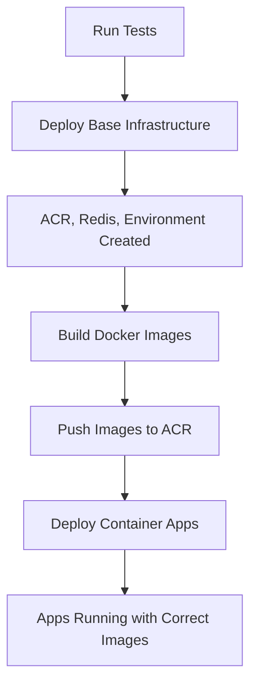

# Azure Deployment Fix

## Problem

The initial deployment was failing with this error:

```
Field 'template.containers.peer-service.image' is invalid with details:
'Invalid value: "sorchaacr.azurecr.io/peer-service:latest":
GET https:: MANIFEST_UNKNOWN: manifest tagged by "latest" is not found
```

### Root Cause

The Bicep template was trying to create Container Apps with Docker images that didn't exist yet in the Azure Container Registry. The workflow was:

1. ❌ Deploy infrastructure (including Container Apps) - **FAILED because images don't exist**
2. Build Docker images
3. Push images to ACR

## Solution

Split the deployment into 3 phases:

### Phase 1: Deploy Base Infrastructure
- Creates Resource Group
- Creates Azure Container Registry (ACR)
- Creates Azure Cache for Redis
- Creates Container Apps Environment
- Creates Log Analytics Workspace

**Files**: [`infra/base-infra.bicep`](base-infra.bicep), [`infra/base-resources.bicep`](base-resources.bicep)

### Phase 2: Build and Push Images
- Builds Docker images for all services
- Pushes images to the ACR created in Phase 1

**Workflow**: [`.github/workflows/azure-deploy.yml`](../.github/workflows/azure-deploy.yml)

### Phase 3: Deploy Container Apps
- Creates Container Apps that reference the images now available in ACR
- Configures environment variables and secrets
- Sets up ingress and scaling rules

**File**: [`infra/container-apps.bicep`](container-apps.bicep)

## New Deployment Flow



## File Structure

```
infra/
├── base-infra.bicep          # Main template for base infrastructure (subscription scope)
├── base-resources.bicep       # Base resources: ACR, Redis, Environment, Logs
├── container-apps.bicep       # Container Apps template (deployed after images exist)
├── main.bicep                 # Original monolithic template (legacy)
├── resources.bicep            # Original resources template (legacy)
└── README.md                  # Documentation
```

## Workflow Changes

The [`.github/workflows/azure-deploy.yml`](../.github/workflows/azure-deploy.yml) workflow now has these steps:

1. **Run Tests** - Ensure code quality
2. **Deploy Base Infrastructure** - Create ACR, Redis, Environment
3. **Login to ACR** - Authenticate with Azure Container Registry
4. **Build and Push Images** - Build and push all 4 Docker images
5. **Deploy Container Apps** - Create Container Apps with existing images
6. **Get URLs** - Retrieve deployment URLs for testing

## Testing the Fix

After pushing this fix, the deployment should succeed. You can verify by:

1. **Check GitHub Actions**:
   - Go to Actions tab in your repository
   - Watch the "Azure Deployment" workflow
   - All steps should complete successfully

2. **Verify Azure Resources**:
   ```bash
   # List Container Apps
   az containerapp list --resource-group sorcha --output table

   # Get URLs
   az containerapp show --name api-gateway --resource-group sorcha \
     --query properties.configuration.ingress.fqdn -o tsv

   az containerapp show --name blazor-client --resource-group sorcha \
     --query properties.configuration.ingress.fqdn -o tsv
   ```

3. **Test the Application**:
   ```bash
   # Test API Gateway
   curl https://<api-gateway-url>/health

   # Open Blazor Client
   open https://<blazor-client-url>
   ```

## Subsequent Deployments

For future deployments:
- Base infrastructure is only created once
- Only images and Container Apps are updated
- Deployment is much faster (~5-10 minutes vs 15-20 minutes)

## Cost Impact

No change in costs. The split deployment approach doesn't add any additional resources or costs.

## Rollback

If you need to rollback:

```bash
# Delete just the Container Apps
az containerapp delete --name api-gateway --resource-group sorcha --yes
az containerapp delete --name blazor-client --resource-group sorcha --yes
az containerapp delete --name blueprint-api --resource-group sorcha --yes
az containerapp delete --name peer-service --resource-group sorcha --yes

# Or delete everything
az group delete --name sorcha --yes --no-wait
```

## Next Deployment

When you push to `main` or `master` branch again:
- Tests run
- Base infrastructure is updated (idempotent - no changes if already exists)
- New Docker images are built with the latest code
- Container Apps are updated with the new images
- Zero downtime deployment (new revisions replace old ones)
