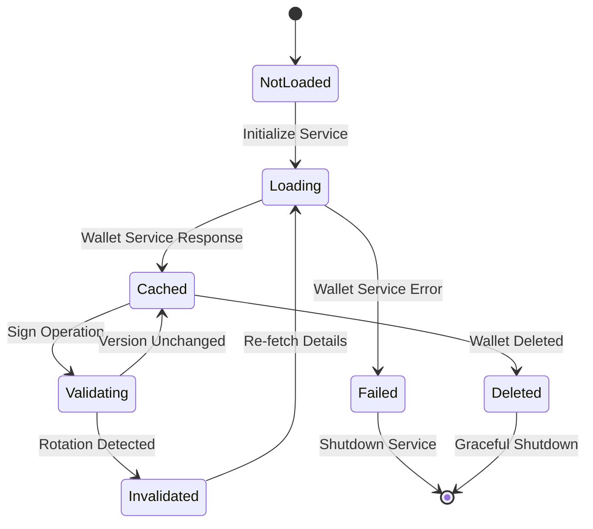
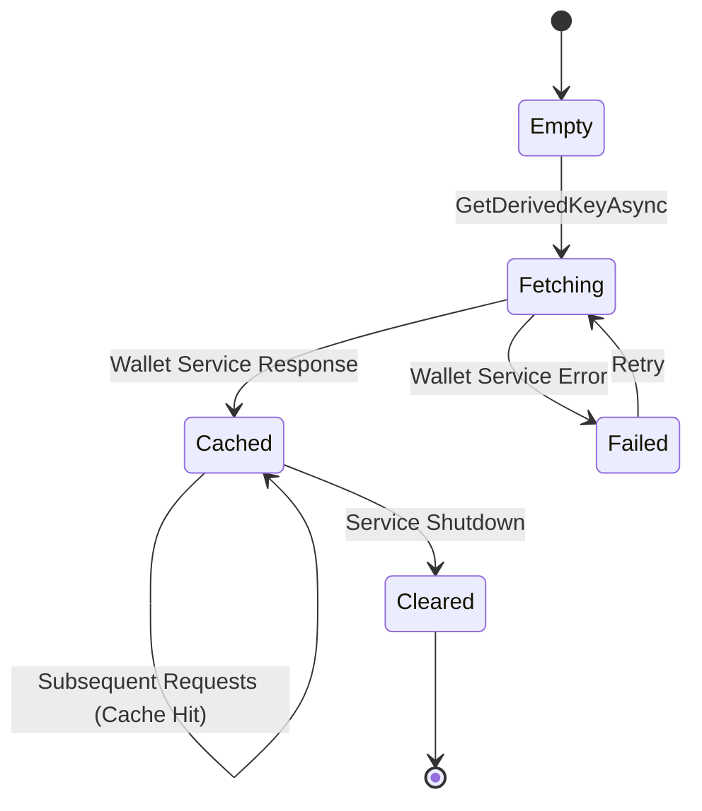

# Data Model: Validator Service Wallet Access

**Feature**: 001-validator-service-wallet
**Date**: 2026-01-04
**Phase**: Phase 1 - Design & Contracts

## Purpose

This document defines the domain entities, value objects, and data structures required for the Validator Service wallet integration feature. All entities are designed to support the functional requirements and acceptance criteria defined in [spec.md](spec.md).

---

## Domain Entities

### 1. WalletDetails

**Purpose**: Represents cached information about the validator's wallet retrieved from the Wallet Service.

**Lifecycle**: Created once during Validator Service initialization, cached in memory for service lifetime, invalidated on wallet rotation detection.

**Fields**:

| Field | Type | Required | Description | Validation Rules |
|-------|------|----------|-------------|------------------|
| `WalletId` | `string` | Yes | Unique identifier for the wallet | Non-empty GUID or alphanumeric ID |
| `Address` | `string` | Yes | Bech32-encoded wallet address (e.g., `ws11q...`) | Valid Bech32 format with `ws1` prefix |
| `PublicKey` | `byte[]` | Yes | Public key bytes for signature verification | Non-empty byte array |
| `Algorithm` | `WalletAlgorithm` enum | Yes | Cryptographic algorithm (ED25519, NISTP256, RSA4096) | Valid enum value |
| `Version` | `int` | Yes | Wallet version for rotation detection | Positive integer |
| `DerivationPath` | `string` | No | BIP44 derivation path (e.g., `m/44'/0'/0'/0/0`) | Valid BIP44 path format |
| `CachedAt` | `DateTimeOffset` | Yes | Timestamp when wallet details were cached | UTC timestamp |

**Relationships**:
- Referenced by: `WalletIntegrationService` (singleton cache)
- References: None (value object)

**Example**:
```csharp
public class WalletDetails
{
    public required string WalletId { get; init; }
    public required string Address { get; init; }
    public required byte[] PublicKey { get; init; }
    public required WalletAlgorithm Algorithm { get; init; }
    public required int Version { get; init; }
    public string? DerivationPath { get; init; }
    public required DateTimeOffset CachedAt { get; init; }
}
```

**State Transitions**:
```
[Initial] → [Cached] → [Invalidated on Rotation] → [Re-Cached]
           ↓
      [Invalidated on Deletion] → [Service Shutdown]
```

---

### 2. WalletConfiguration

**Purpose**: Configuration settings for wallet integration, loaded from Tenant Service or environment variables.

**Lifecycle**: Created during service startup, immutable for service lifetime (requires restart to change).

**Fields**:

| Field | Type | Required | Description | Validation Rules |
|-------|------|----------|-------------|------------------|
| `WalletId` | `string` | Yes | The wallet ID to use for validator operations | Non-empty string |
| `WalletServiceEndpoint` | `Uri` | Yes | gRPC endpoint for Wallet Service (e.g., `https://localhost:7084`) | Valid URI |
| `TenantServiceEndpoint` | `Uri` | Yes | gRPC endpoint for Tenant Service | Valid URI |
| `SystemOrganizationId` | `string` | Yes | ID of the system organization | Non-empty GUID |
| `RetryPolicy` | `RetryPolicyConfiguration` | Yes | Retry policy settings | Valid configuration object |

**Nested Type: RetryPolicyConfiguration**:

| Field | Type | Required | Description | Default |
|-------|------|----------|-------------|---------|
| `MaxRetries` | `int` | Yes | Maximum retry attempts | 3 |
| `BackoffMultiplier` | `double` | Yes | Exponential backoff multiplier | 2.0 |
| `InitialDelaySeconds` | `int` | Yes | Initial delay before first retry | 1 |

**Example**:
```csharp
public class WalletConfiguration
{
    public required string WalletId { get; init; }
    public required Uri WalletServiceEndpoint { get; init; }
    public required Uri TenantServiceEndpoint { get; init; }
    public required string SystemOrganizationId { get; init; }
    public required RetryPolicyConfiguration RetryPolicy { get; init; }
}

public class RetryPolicyConfiguration
{
    public int MaxRetries { get; init; } = 3;
    public double BackoffMultiplier { get; init; } = 2.0;
    public int InitialDelaySeconds { get; init; } = 1;
}
```

**Configuration Source Priority**:
1. Environment variable `VALIDATOR_WALLET_ID` → `WalletConfiguration.WalletId`
2. Tenant Service system organization config → `WalletConfiguration.WalletId`
3. appsettings.json → All other fields

---

### 3. Signature

**Purpose**: Represents a cryptographic signature produced by the validator wallet.

**Lifecycle**: Created when signing dockets or consensus votes, attached to domain objects (Docket, ConsensusVote), persisted to Register Service.

**Fields**:

| Field | Type | Required | Description | Validation Rules |
|-------|------|----------|-------------|------------------|
| `PublicKey` | `byte[]` | Yes | Public key that can verify this signature | Non-empty byte array |
| `SignatureValue` | `byte[]` | Yes | The cryptographic signature bytes | Non-empty byte array |
| `Algorithm` | `string` | Yes | Algorithm used (e.g., "ED25519", "NISTP256") | Valid algorithm name |
| `SignedAt` | `DateTimeOffset` | Yes | Timestamp when signature was created | UTC timestamp |
| `SignedBy` | `string` | No | Wallet address of the signer | Valid Bech32 address |

**Example**:
```csharp
public class Signature
{
    public required byte[] PublicKey { get; init; }
    public required byte[] SignatureValue { get; init; }
    public required string Algorithm { get; init; }
    public required DateTimeOffset SignedAt { get; init; }
    public string? SignedBy { get; init; }

    /// <summary>
    /// Validates the signature against a hash using Sorcha.Cryptography.
    /// </summary>
    public async Task<bool> VerifyAsync(
        byte[] hash,
        ICryptoModule cryptoModule,
        CancellationToken ct = default)
    {
        var network = ParseAlgorithmToByte(Algorithm);
        var status = await cryptoModule.VerifyAsync(
            SignatureValue, hash, network, PublicKey, ct);
        return status == CryptoStatus.Success;
    }
}
```

**Usage Context**:
- Attached to `Docket.ProposerSignature` when docket is finalized
- Attached to `ConsensusVote.ValidatorSignature` when vote is cast
- Verified by peers during consensus validation

---

### 4. DerivedKeyCache (Internal)

**Purpose**: Thread-safe cache for derived private keys retrieved from Wallet Service.

**Lifecycle**: Created on first derived key request, lives for service lifetime, cleared on shutdown.

**Security**: Keys cached in memory only, never persisted to disk/logs/configuration (per SC-006).

**Fields**:

| Field | Type | Description |
|-------|------|-------------|
| `_cache` | `Dictionary<string, byte[]>` | Derivation path → private key bytes |
| `_cacheLock` | `SemaphoreSlim` | Async-compatible lock for thread safety |

**Operations**:
- `GetDerivedKeyAsync(path)`: Retrieves key from cache or fetches from Wallet Service
- `InvalidateAsync()`: Clears all cached keys (called on shutdown)

**Example**:
```csharp
internal class DerivedKeyCache : IDisposable
{
    private readonly Dictionary<string, byte[]> _cache = new();
    private readonly SemaphoreSlim _cacheLock = new(1, 1);

    public async Task<byte[]> GetOrFetchAsync(
        string derivationPath,
        Func<string, Task<byte[]>> fetchFunc,
        CancellationToken ct)
    {
        if (_cache.TryGetValue(derivationPath, out var cachedKey))
            return cachedKey;

        await _cacheLock.WaitAsync(ct);
        try
        {
            if (_cache.TryGetValue(derivationPath, out cachedKey))
                return cachedKey;

            var key = await fetchFunc(derivationPath);
            _cache[derivationPath] = key;
            return key;
        }
        finally
        {
            _cacheLock.Release();
        }
    }

    public void Dispose()
    {
        // Zero out private keys before disposal (security best practice)
        foreach (var key in _cache.Values)
        {
            Array.Clear(key, 0, key.Length);
        }
        _cache.Clear();
        _cacheLock.Dispose();
    }
}
```

---

## Value Objects

### WalletAlgorithm Enum

**Purpose**: Represents supported cryptographic algorithms for wallet operations.

**Values**:

| Value | Integer | Description | Key Size |
|-------|---------|-------------|----------|
| `ED25519` | 0 | Edwards-curve Digital Signature Algorithm | 32 bytes |
| `NISTP256` | 1 | NIST P-256 (secp256r1) elliptic curve | 32 bytes |
| `RSA4096` | 2 | RSA with 4096-bit keys | 512 bytes |

**Example**:
```csharp
public enum WalletAlgorithm : byte
{
    ED25519 = 0,
    NISTP256 = 1,
    RSA4096 = 2
}
```

**Mapping to Sorcha.Cryptography**:
```csharp
public static WalletNetworks ToWalletNetwork(this WalletAlgorithm algorithm) =>
    algorithm switch
    {
        WalletAlgorithm.ED25519 => WalletNetworks.ED25519,
        WalletAlgorithm.NISTP256 => WalletNetworks.NISTP256,
        WalletAlgorithm.RSA4096 => WalletNetworks.RSA4096,
        _ => throw new ArgumentException($"Unknown algorithm: {algorithm}")
    };
```

---

## Modified Existing Entities

### Docket (Existing Entity - Modified)

**Changes Required**:
- Add `ProposerSignature` field of type `Signature`
- Add `ProposerValidatorId` field (wallet address)

**Example Modification**:
```csharp
public class Docket
{
    // ... existing fields ...
    public required string RegisterId { get; set; }
    public required long DocketNumber { get; set; }
    public required List<Transaction> Transactions { get; set; }

    // NEW: Validator wallet signature
    public Signature? ProposerSignature { get; set; }

    // NEW: Validator wallet address
    public string? ProposerValidatorId { get; set; }

    // ... existing fields ...
}
```

**Validation Rules**:
- `ProposerSignature` MUST be present before broadcasting to peers (FR-003)
- `ProposerValidatorId` MUST match validator's wallet address (FR-006)
- Signature MUST verify against docket hash using `ProposerValidatorId` public key

---

### ConsensusVote (Existing Entity - Modified)

**Changes Required**:
- Add `ValidatorSignature` field of type `Signature`
- Ensure `ValidatorId` is set to wallet address

**Example Modification**:
```csharp
public class ConsensusVote
{
    public required string VoteId { get; set; }
    public required string RegisterId { get; set; }
    public required long DocketNumber { get; set; }
    public required VoteDecision Decision { get; set; }
    public string? RejectionReason { get; set; }

    // Validator wallet address
    public required string ValidatorId { get; set; }

    // NEW: Validator wallet signature
    public required Signature ValidatorSignature { get; set; }

    public required DateTimeOffset VotedAt { get; set; }
}
```

**Validation Rules**:
- `ValidatorSignature` MUST be present before sending VoteResponse (FR-004)
- `ValidatorId` MUST match signing wallet address
- Peer validators MUST verify signature before counting vote (FR-005)

---

### OrganizationConfiguration (Tenant Service - Modified)

**Changes Required**:
- Add `ValidatorWalletId` field to system organization configuration

**Example Modification**:
```csharp
public class OrganizationConfiguration
{
    public required string OrganizationId { get; set; }
    public required string OrganizationName { get; set; }
    public required string Subdomain { get; set; }

    // NEW: Validator wallet configuration
    public string? ValidatorWalletId { get; set; }

    // ... other configuration fields ...
}
```

**Access Control**:
- Only system administrators can modify `ValidatorWalletId`
- Read access required for Validator Service during initialization

---

## Entity Relationships Diagram

```
┌─────────────────────────────┐
│   WalletConfiguration       │
│  (Startup configuration)    │
└──────────────┬──────────────┘
               │ uses
               ↓
┌─────────────────────────────┐
│  WalletIntegrationService   │
│  (Business logic layer)     │
└──────────────┬──────────────┘
               │ caches
               ↓
┌─────────────────────────────┐        ┌──────────────────────┐
│      WalletDetails          │←───────│  DerivedKeyCache     │
│  (Cached wallet info)       │        │  (Private keys)      │
└──────────────┬──────────────┘        └──────────────────────┘
               │ produces
               ↓
┌─────────────────────────────┐
│        Signature            │
│  (Cryptographic signature)  │
└──────────────┬──────────────┘
               │ attached to
               ↓
       ┌───────────────┬──────────────┐
       │               │              │
       ↓               ↓              ↓
┌──────────┐   ┌──────────────┐   ┌────────────────────┐
│  Docket  │   │ ConsensusVote│   │  Genesis Docket    │
└──────────┘   └──────────────┘   └────────────────────┘
```

---

## Validation Rules Summary

### Field-Level Validation

| Entity | Field | Validation Rule |
|--------|-------|-----------------|
| `WalletDetails` | `WalletId` | Non-empty, valid GUID or alphanumeric ID |
| `WalletDetails` | `Address` | Bech32 format with `ws1` prefix |
| `WalletDetails` | `PublicKey` | Non-empty byte array, length matches algorithm |
| `WalletDetails` | `Algorithm` | Must be ED25519, NISTP256, or RSA4096 |
| `WalletDetails` | `Version` | Positive integer |
| `Signature` | `SignatureValue` | Non-empty byte array, valid for algorithm |
| `Signature` | `PublicKey` | Non-empty, length matches algorithm |
| `WalletConfiguration` | `WalletId` | Non-empty string |
| `WalletConfiguration` | `*Endpoint` | Valid URI with https:// scheme |

### Entity-Level Validation

| Entity | Rule | Error Condition |
|--------|------|-----------------|
| `Docket` | Signature required | `ProposerSignature` is null when broadcasting to peers |
| `Docket` | Validator ID matches | `ProposerValidatorId` doesn't match wallet address |
| `Docket` | Signature verification | Signature doesn't verify against docket hash |
| `ConsensusVote` | Signature required | `ValidatorSignature` is null when sending vote response |
| `ConsensusVote` | Vote signature verification | Signature doesn't verify against vote hash |

### Cross-Entity Validation

| Validation | Rule | Example |
|------------|------|---------|
| Wallet rotation detection | Compare `WalletDetails.Version` before and after operation | If version changes from 1 to 2, invalidate cache |
| Derived key path | BIP44 format: `m/44'/coin'/account'/change/index` | Valid: `m/44'/0'/0'/0/0`, Invalid: `m/0/0/0` |
| Algorithm consistency | Signature algorithm matches wallet algorithm | ED25519 wallet cannot produce RSA4096 signature |

---

## Persistence Strategy

### In-Memory (Ephemeral)

| Entity | Storage | Lifetime | Security Notes |
|--------|---------|----------|----------------|
| `WalletDetails` | Service singleton field | Service lifetime | Invalidated on rotation |
| `DerivedKeyCache` | Dictionary in service | Service lifetime | Zeroed on disposal (SC-006) |
| `WalletConfiguration` | IOptions singleton | Service lifetime | Loaded once at startup |

### Persistent (Database/Register)

| Entity | Storage | Lifetime | Location |
|--------|---------|----------|----------|
| `Signature` (on Docket) | Register Service | Permanent | Blockchain ledger |
| `Signature` (on ConsensusVote) | Register Service | Permanent | Consensus log |
| `OrganizationConfiguration` | Tenant Service DB | Until modified | PostgreSQL |

### Never Persisted (Security Requirement)

| Data | Reason | Reference |
|------|--------|-----------|
| Root private key | Security: FR-012 | Never accessed by Validator |
| Derived private keys | Security: SC-006 | Memory only, never logged/stored on disk |
| Mnemonic phrases | User responsibility | Not stored in any service |

---

## State Management

### WalletDetails State Transitions



### DerivedKeyCache State Transitions



---

## Implementation Notes

### Thread Safety

All caching operations use `SemaphoreSlim` for async-compatible locking:
- `WalletDetails` cache: Single `SemaphoreSlim` for read/invalidate/refresh
- `DerivedKeyCache`: Single `SemaphoreSlim` for fetch/cache operations

### Performance Considerations

- **WalletDetails**: Cached to avoid gRPC call on every operation (~120ms saved per operation)
- **DerivedKeyCache**: Enables local signing with Sorcha.Cryptography (~100ms saved per signature)
- **Target**: 10 dockets/sec signing throughput (achievable with local signing, not achievable with remote calls)

### Security Best Practices

1. **Memory Clearing**: Zero out byte arrays (private keys) on disposal
2. **No Logging**: Never log private keys, signatures, or wallet IDs in plaintext
3. **No Persistence**: Derived keys stay in memory only
4. **Rotation Detection**: Always compare version before/after operations
5. **Deletion Detection**: Handle wallet deletion gracefully (shutdown, don't crash)

---

## Next Steps

### contracts/ Directory
Generate gRPC proto definitions:
- `wallet_service.proto` - Wallet Service gRPC contract
- `tenant_service.proto` - Tenant Service system org config extension

### quickstart.md
Developer guide for:
- Configuring validator wallet ID
- Testing wallet integration locally
- Debugging common issues

---

**Status**: ✅ Data model design complete. Ready for contract generation.
