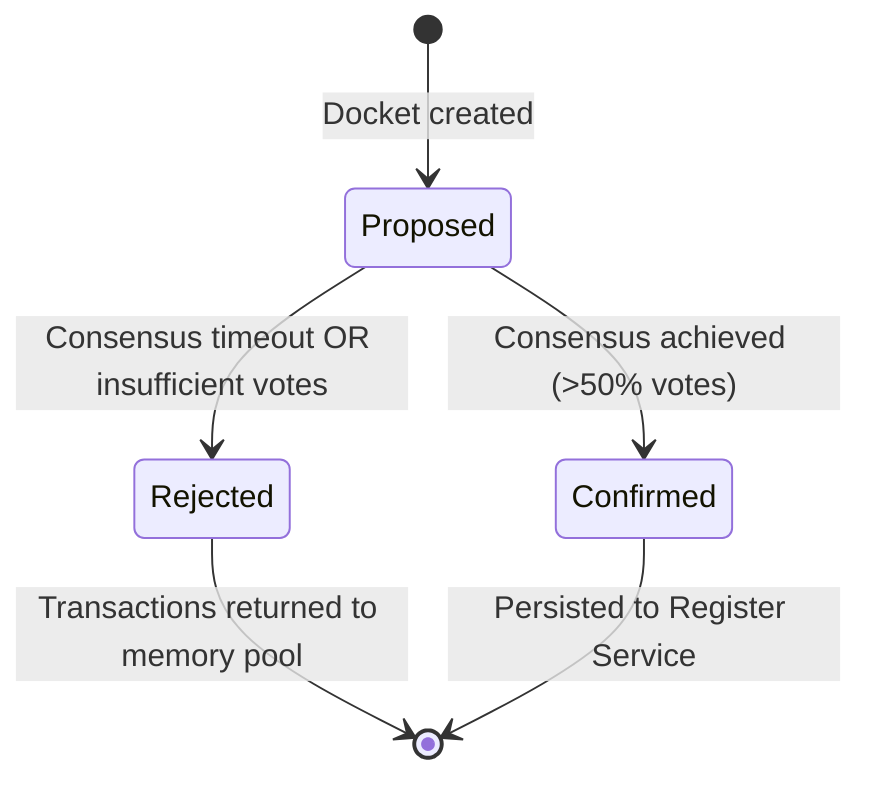
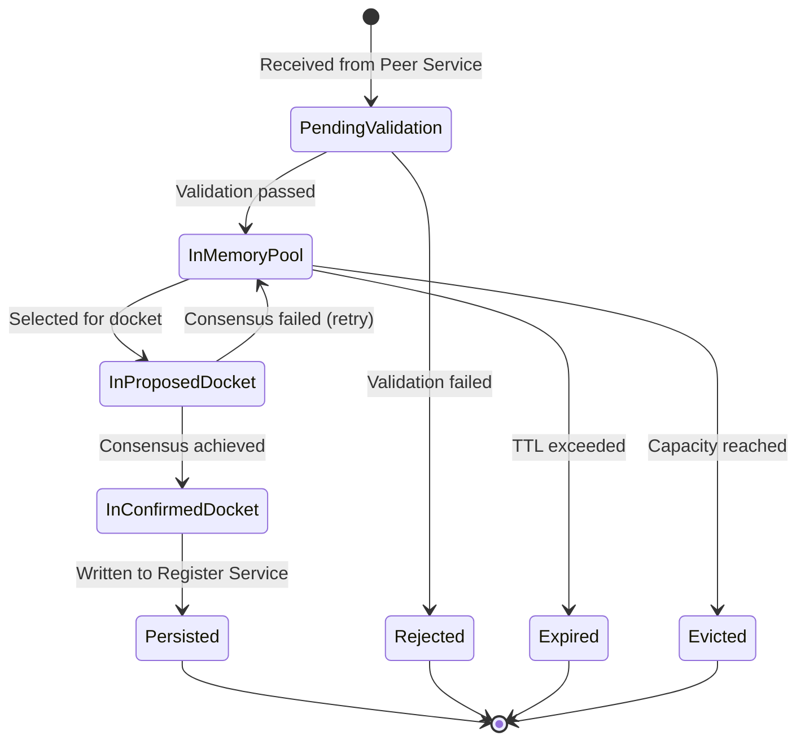
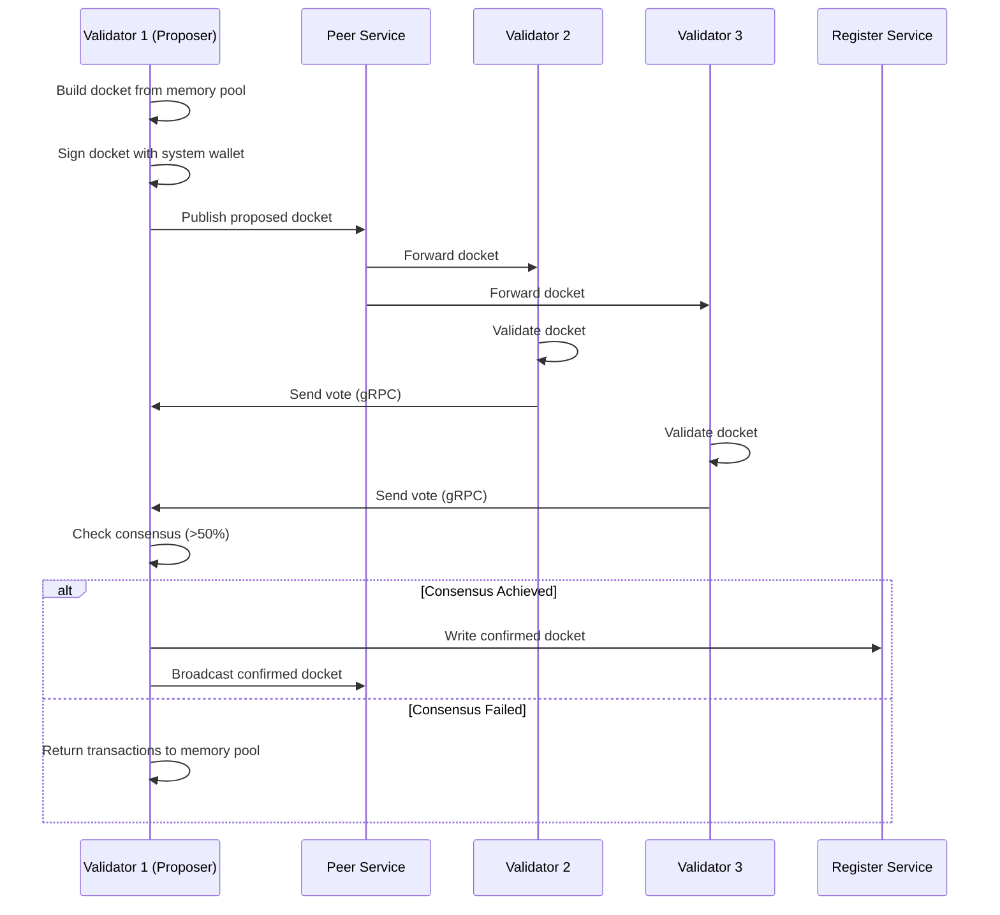

# Data Model: Validator Service

**Date**: 2025-12-22
**Feature**: Validator Service - Distributed Transaction Validation and Consensus
**Branch**: `002-validator-service`

## Overview

This document defines the core entities, relationships, validation rules, and state machines for the Validator Service. All models follow Sorcha's domain-driven design principles and ubiquitous language.

---

## Core Entities

### 1. Transaction

**Description**: A signed record of a blueprint action execution awaiting validation and inclusion in a docket.

**Fields**:
```csharp
public class Transaction
{
    // Identity
    public string TransactionId { get; set; }             // Unique identifier (GUID or hash)
    public string RegisterId { get; set; }                // Target register

    // Blueprint Context
    public string BlueprintId { get; set; }               // Blueprint definition ID
    public string ActionId { get; set; }                  // Specific action within blueprint
    public JsonElement Payload { get; set; }              // Action-specific data

    // Timestamps
    public DateTimeOffset CreatedAt { get; set; }         // Transaction creation time
    public DateTimeOffset? ExpiresAt { get; set; }        // TTL for memory pool eviction

    // Cryptography
    public List<Signature> Signatures { get; set; }       // One or more signatures
    public string PayloadHash { get; set; }               // SHA256 of payload

    // Memory Pool Management
    public TransactionPriority Priority { get; set; }     // Low/Normal/High
    public DateTimeOffset AddedToPoolAt { get; set; }     // When added to memory pool
    public int RetryCount { get; set; }                   // Failed consensus retries

    // Metadata
    public Dictionary<string, string> Metadata { get; set; }  // Extensible key-value pairs
}

public enum TransactionPriority
{
    Low = 0,
    Normal = 1,      // Default
    High = 2         // Limited to 10% of memory pool
}

public class Signature
{
    public string PublicKey { get; set; }          // Signer's public key
    public string SignatureValue { get; set; }     // Base64-encoded signature
    public string Algorithm { get; set; }          // ED25519, NIST-P256, RSA-4096
}
```

**Validation Rules**:
- `TransactionId` MUST be unique within a register
- `RegisterId` MUST reference an existing register
- `BlueprintId` MUST exist in Blueprint Service
- `Payload` MUST validate against blueprint JSON schema (via blueprint validation library)
- `Signatures` MUST contain at least one valid signature
- `PayloadHash` MUST match SHA256(Payload)
- `ExpiresAt` (if set) MUST be future timestamp
- `Priority` defaults to `Normal`; `High` limited by memory pool quota

**Relationships**:
- Belongs to one `Register` (1:N)
- References one `Blueprint` (N:1)
- Can appear in zero or one `Docket` (N:0..1)
- Stored temporarily in one `MemoryPool` (N:1)

---

### 2. Docket (Block)

**Description**: A container of validated transactions forming a link in the blockchain for a specific register.

**Fields**:
```csharp
public class Docket
{
    // Identity
    public string DocketId { get; set; }                  // Unique identifier (hash of docket)
    public string RegisterId { get; set; }                // Target register
    public long DocketNumber { get; set; }                // Sequential number (0 = genesis)

    // Chain Linkage
    public string? PreviousHash { get; set; }             // Hash of previous docket (null for genesis)
    public string DocketHash { get; set; }                // SHA256 of this docket's content

    // Timestamps
    public DateTimeOffset CreatedAt { get; set; }         // When docket was created
    public DateTimeOffset? ConsensuslAchievedAt { get; set; }  // When consensus confirmed

    // Content
    public List<Transaction> Transactions { get; set; }   // Included transactions (0-N)
    public int TransactionCount { get; set; }             // Count for quick access

    // Consensus
    public DocketStatus Status { get; set; }              // Proposed/Confirmed/Rejected
    public string ProposerValidatorId { get; set; }       // Validator that created this docket
    public Signature ProposerSignature { get; set; }      // Proposer's signature
    public List<ConsensusVote> Votes { get; set; }        // Validator votes (empty for proposed)

    // Metadata
    public string MerkleRoot { get; set; }                // Merkle tree root of transactions
    public Dictionary<string, string> Metadata { get; set; }
}

public enum DocketStatus
{
    Proposed = 0,      // Created, awaiting consensus
    Confirmed = 1,     // Consensus achieved, persisted
    Rejected = 2       // Consensus failed
}
```

**Validation Rules**:
- `DocketNumber` MUST be consecutive (previous + 1), except genesis (0)
- `PreviousHash` MUST be null if `DocketNumber == 0`, non-null otherwise
- `PreviousHash` MUST match the hash of the docket at `DocketNumber - 1`
- `DocketHash` MUST be SHA256(RegisterId + DocketNumber + PreviousHash + MerkleRoot + CreatedAt)
- `CreatedAt` MUST be >= previous docket's `CreatedAt` (monotonically increasing)
- `Transactions` MUST all validate individually
- `MerkleRoot` MUST be valid Merkle tree root of transaction hashes
- `ProposerSignature` MUST be valid signature from `ProposerValidatorId`'s wallet
- `Votes` (if Confirmed) MUST have >50% of active validators (configurable threshold)

**State Machine**:


**Relationships**:
- Belongs to one `Register` (1:N)
- Contains zero or more `Transactions` (1:N)
- Has multiple `ConsensusVotes` (1:N)
- Links to previous `Docket` via `PreviousHash` (1:0..1)

---

### 3. ConsensusVote

**Description**: A signed approval or rejection of a proposed docket by a validator.

**Fields**:
```csharp
public class ConsensusVote
{
    // Identity
    public string VoteId { get; set; }                    // Unique identifier
    public string DocketId { get; set; }                  // Target docket
    public string ValidatorId { get; set; }               // Voting validator

    // Vote Decision
    public VoteDecision Decision { get; set; }            // Approve/Reject
    public string? RejectionReason { get; set; }          // If Reject, why?

    // Timestamps
    public DateTimeOffset VotedAt { get; set; }           // When vote cast

    // Cryptography
    public Signature ValidatorSignature { get; set; }     // Validator's signature
    public string DocketHash { get; set; }                // Hash of docket being voted on
}

public enum VoteDecision
{
    Reject = 0,
    Approve = 1
}
```

**Validation Rules**:
- `ValidatorId` MUST be an active validator in the network (from Peer Service)
- `ValidatorSignature` MUST be valid signature from validator's system wallet
- `DocketHash` MUST match the `DocketHash` of the referenced docket
- Validator MUST NOT vote twice on the same docket (enforced by Consensus Engine)
- `RejectionReason` MUST be present if `Decision == Reject`

**Relationships**:
- Belongs to one `Docket` (N:1)
- Created by one `ValidatorInstance` (N:1)

---

### 4. MemoryPool

**Description**: A temporary cache of pending transactions for a specific register, awaiting inclusion in a docket.

**Fields**:
```csharp
public class MemoryPool
{
    // Identity
    public string RegisterId { get; set; }                // Register this pool serves

    // Transactions (in-memory or Redis)
    private readonly PriorityQueue<Transaction, TransactionPriority> _highPriorityQueue;
    private readonly ConcurrentQueue<Transaction> _normalQueue;  // FIFO
    private readonly ConcurrentQueue<Transaction> _lowPriorityQueue;

    // Configuration
    public int MaxSize { get; set; }                      // Max transactions (default 10,000)
    public TimeSpan DefaultTTL { get; set; }              // Default expiration (e.g., 1 hour)

    // Metrics
    public int CurrentSize => GetTotalCount();
    public int HighPriorityCount { get; private set; }
    public int NormalPriorityCount { get; private set; }
    public int LowPriorityCount { get; private set; }

    // Statistics
    public DateTimeOffset LastEviction { get; set; }
    public int TotalEvictions { get; set; }
    public int TotalExpired { get; set; }
}
```

**Validation Rules**:
- `CurrentSize` MUST NOT exceed `MaxSize`
- High-priority transactions MUST NOT exceed 10% of `MaxSize`
- Expired transactions (past `ExpiresAt`) MUST be automatically removed
- On capacity: evict oldest FIFO transaction, unless incoming is high-priority (then evict oldest low-priority)

**Relationships**:
- Belongs to one `Register` (1:1)
- Contains zero or more `Transactions` (1:N)

**Operations**:
- `AddTransaction(tx)`: Add with priority-based queuing
- `RemoveTransaction(txId)`: Remove by ID (when included in docket)
- `GetPendingTransactions(count, priority)`: Retrieve transactions for docket building
- `EvictOldest()`: Remove oldest transaction (FIFO eviction)
- `CleanupExpired()`: Remove expired transactions (background task)

---

### 5. RegisterValidationContext

**Description**: The isolated validation environment for a specific register, including its blueprint rules, chain state, and memory pool.

**Fields**:
```csharp
public class RegisterValidationContext
{
    // Identity
    public string RegisterId { get; set; }

    // Blockchain State
    public long CurrentHeight { get; set; }                // Latest docket number
    public string LatestDocketHash { get; set; }           // Head of chain
    public DateTimeOffset LastDocketTime { get; set; }     // Timestamp of latest docket

    // Validation Rules (from Blueprint Service)
    public string BlueprintId { get; set; }                // Active blueprint
    public JsonSchema ValidationSchema { get; set; }       // JSON schema for transactions

    // Memory Pool
    public MemoryPool MemoryPool { get; set; }

    // Configuration
    public ConsensusConfiguration Consensus { get; set; }  // Threshold, timeout, etc.
    public MemPoolConfiguration MemPoolConfig { get; set; }  // Size, TTL, etc.
    public DocketBuildConfiguration DocketConfig { get; set; }  // Time/size thresholds

    // Metrics
    public long TotalTransactionsProcessed { get; set; }
    public long TotalDocketsCreated { get; set; }
    public double AverageValidationTime { get; set; }
}
```

**Validation Rules**:
- Each `RegisterId` MUST have exactly one validation context
- `CurrentHeight` MUST match the latest docket number in Register Service
- `LatestDocketHash` MUST match the hash of docket at `CurrentHeight`
- `ValidationSchema` MUST be current blueprint schema from Blueprint Service

**Relationships**:
- Belongs to one `Register` (1:1)
- Has one `MemoryPool` (1:1)
- References one `Blueprint` (N:1)

---

### 6. ValidatorInstance

**Description**: A running instance of the Validator Service that participates in distributed consensus.

**Fields**:
```csharp
public class ValidatorInstance
{
    // Identity
    public string ValidatorId { get; set; }                // Unique instance ID (GUID)
    public string SystemWalletAddress { get; set; }        // Public key of system wallet

    // Network
    public string GrpcEndpoint { get; set; }               // gRPC address (e.g., https://validator1:5001)
    public double ReputationScore { get; set; }            // From Peer Service (0.0-1.0)

    // Status
    public ValidatorStatus Status { get; set; }            // Active/Inactive/Suspended
    public DateTimeOffset LastHeartbeat { get; set; }      // Last seen timestamp

    // Statistics
    public long ProposedDockets { get; set; }              // Total dockets proposed
    public long InvalidDockets { get; set; }               // Invalid dockets proposed (affects reputation)
    public long VotesCast { get; set; }                    // Total votes cast
    public double UptimePercentage { get; set; }           // Availability metric
}

public enum ValidatorStatus
{
    Inactive = 0,
    Active = 1,
    Suspended = 2    // Low reputation, reduced connectivity
}
```

**Validation Rules**:
- `ValidatorId` MUST be unique globally
- `SystemWalletAddress` MUST be valid public key
- `GrpcEndpoint` MUST be accessible via gRPC
- `ReputationScore` MUST be 0.0-1.0 (managed by Peer Service)
- `Status == Suspended` if `ReputationScore < 0.5` (configurable threshold)

**Relationships**:
- Has one `SystemWallet` (via Wallet Service) (1:1)
- Participates in multiple `Registers` (N:M)
- Creates `Dockets` (1:N)
- Casts `ConsensusVotes` (1:N)

---

## Configuration Models

### ConsensusConfiguration

```csharp
public class ConsensusConfiguration
{
    public double ApprovalThreshold { get; set; } = 0.51;   // >50% by default
    public TimeSpan VoteTimeout { get; set; } = TimeSpan.FromSeconds(30);
    public int MaxRetries { get; set; } = 3;
    public bool RequireQuorum { get; set; } = true;          // Fail if <50% validators reachable
}
```

### MemPoolConfiguration

```csharp
public class MemPoolConfiguration
{
    public int MaxSize { get; set; } = 10_000;
    public TimeSpan DefaultTTL { get; set; } = TimeSpan.FromHours(1);
    public double HighPriorityQuota { get; set; } = 0.10;    // 10% max high-priority
    public TimeSpan CleanupInterval { get; set; } = TimeSpan.FromMinutes(5);
}
```

### DocketBuildConfiguration

```csharp
public class DocketBuildConfiguration
{
    public TimeSpan TimeThreshold { get; set; } = TimeSpan.FromSeconds(10);
    public int SizeThreshold { get; set; } = 50;
    public int MaxTransactionsPerDocket { get; set; } = 100;
    public bool AllowEmptyDockets { get; set; } = false;
}
```

---

## State Machines

### Transaction Lifecycle



### Docket Consensus Workflow



---

## Validation Matrix

| Entity | Validation Rule | Enforced By | Consequence of Violation |
|--------|----------------|-------------|--------------------------|
| Transaction | Valid signatures | TransactionValidator | Reject transaction |
| Transaction | Blueprint schema compliance | Blueprint validation library | Reject transaction |
| Transaction | Unique TransactionId | MemPoolManager | Reject duplicate |
| Docket | Consecutive DocketNumber | ChainValidator | Reject docket, flag proposer |
| Docket | Valid PreviousHash | ChainValidator | Reject docket, flag proposer |
| Docket | Monotonic timestamps | ChainValidator | Reject docket, flag proposer |
| Docket | Valid MerkleRoot | DocketValidator | Reject docket, flag proposer |
| ConsensusVote | Valid signature | ConsensusEngine | Ignore vote |
| ConsensusVote | No double voting | ConsensusEngine | Ignore second vote, flag validator |
| MemoryPool | Size limit | MemPoolManager | Evict oldest or reject |
| MemoryPool | High-priority quota | MemPoolManager | Reject or downgrade to normal |

---

## Indexing & Performance

**Memory Pool Indexes**:
- `TransactionId` → Primary key (O(1) lookup)
- `RegisterId` → Partition key (separate pool per register)
- `Priority` → Queue selection (3 queues: high, normal, low)
- `ExpiresAt` → TTL index for cleanup (sorted set in Redis)

**Docket Chain Indexes**:
- `DocketNumber` → Sequential access (O(1) by number)
- `DocketHash` → Content-addressable (O(1) by hash)
- `RegisterId` → Partition key (per-register chains)

**Consensus Vote Indexes**:
- `DocketId + ValidatorId` → Unique constraint (prevent double voting)
- `DocketId` → Group by docket (count votes)

---

## Data Model Checklist

- [x] All entities from spec.md Key Entities section defined
- [x] Validation rules from Functional Requirements mapped
- [x] State machines for Transaction and Docket lifecycles
- [x] Configuration models for NFR thresholds
- [x] Relationships between entities documented
- [x] Validation matrix for enforcement points
- [x] Performance considerations (indexing strategy)

---

**Data Model Complete**: Proceed to API contract design (Phase 1).
