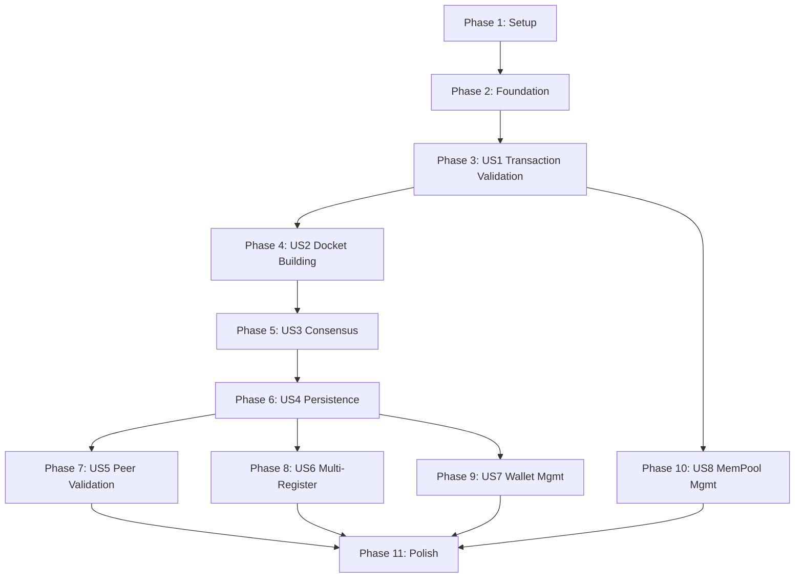

# Implementation Tasks: Validator Service

**Feature Branch**: `002-validator-service`
**Created**: 2025-12-22
**Spec**: [spec.md](./spec.md)
**Plan**: [plan.md](./plan.md)

## Overview

This document breaks down the Validator Service implementation into executable tasks organized by user story. Each phase represents a complete, independently testable increment.

**Total Tasks**: 87
**User Stories**: 8 (4 P1, 3 P2, 1 P3)
**Parallel Opportunities**: 42 tasks marked [P]

---

## Implementation Strategy

### MVP Scope (Recommended)
- **Phase 1**: Setup (T001-T010)
- **Phase 2**: Foundational (T011-T023)
- **Phase 3**: User Story 1 - Transaction Validation (T024-T033)
- **Phase 4**: User Story 2 - Docket Building (T034-T043)

This delivers a working validator that can receive transactions, validate them, and build dockets. Consensus and persistence can be added incrementally.

### Full MVD Scope
- All P1 stories (Phases 3-6): Transaction validation, docket building, consensus, persistence
- P2 stories (Phases 7-9): Peer validation, multi-register support, wallet management
- P3 stories (Phase 10): Advanced memory pool features

---

## Dependency Graph

**Independent Stories** (can be parallelized after Foundation):
- US1, US7 (no dependencies between them)
- US6, US8 (both depend on US1 only)

**Sequential Dependencies**:
- US1 → US2 → US3 → US4 → US5 (core consensus flow)

---

## Phase 1: Setup & Project Initialization

**Goal**: Create project structure, configure tooling, set up core infrastructure

**Tasks**:

- [ ] T001 Create Sorcha.Validator.Core class library project in src/Common/
- [ ] T002 [P] Create Sorcha.Validator.Core.Tests xUnit project in tests/
- [ ] T003 [P] Add project references: Core → Sorcha.Blueprint.Models, Sorcha.Cryptography, Sorcha.Register.Models
- [ ] T004 [P] Configure Sorcha.Validator.Service csproj with .NET 10, C# 13, nullable enabled
- [ ] T005 [P] Add NuGet packages to Validator.Service: Grpc.Net, FluentValidation, OpenTelemetry, Scalar.AspNetCore
- [ ] T006 [P] Create appsettings.json in Sorcha.Validator.Service/ with configuration sections (Validator, Consensus, MemPool, DocketBuild, GrpcClients)
- [ ] T007 [P] Create appsettings.Development.json with debug logging and local service URLs
- [ ] T008 [P] Generate gRPC C# code from specs/002-validator-service/contracts/validator.proto using Grpc.Tools
- [ ] T009 [P] Create directory structure in Sorcha.Validator.Service/ (Endpoints/, Services/, GrpcServices/, Clients/, Models/, Configuration/, Middleware/)
- [ ] T010 Update Sorcha.AppHost to register Validator Service with .NET Aspire orchestration

**Parallel Execution**: T002-T009 can run in parallel (independent files/projects)

---

## Phase 2: Foundational Components (Blocking Prerequisites)

**Goal**: Build shared models, configuration, and core validation logic needed by all user stories

**Tasks**:

- [ ] T011 Create ValidationResult.cs in Sorcha.Validator.Core/Models/ (success/failure, error list)
- [ ] T012 [P] Create ValidationError.cs in Sorcha.Validator.Core/Models/ (error code, message, field)
- [ ] T013 [P] Create ValidationRules.cs in Sorcha.Validator.Core/Models/ (validation rule definitions)
- [ ] T014 [P] Create Transaction.cs model in Sorcha.Validator.Service/Models/ (ID, register, blueprint, payload, signatures, priority)
- [ ] T015 [P] Create Docket.cs model in Sorcha.Validator.Service/Models/ (ID, number, hash, previous hash, transactions, status, votes)
- [ ] T016 [P] Create ConsensusVote.cs model in Sorcha.Validator.Service/Models/ (ID, docket, validator, decision, signature)
- [ ] T017 [P] Create ValidatorConfiguration.cs in Sorcha.Validator.Service/Configuration/ (validator ID, system wallet, max reorg depth)
- [ ] T018 [P] Create ConsensusConfiguration.cs in Sorcha.Validator.Service/Configuration/ (approval threshold, timeout, retries)
- [ ] T019 [P] Create MemPoolConfiguration.cs in Sorcha.Validator.Service/Configuration/ (max size, TTL, priority quota, cleanup interval)
- [ ] T020 [P] Create DocketBuildConfiguration.cs in Sorcha.Validator.Service/Configuration/ (time threshold, size threshold, max transactions)
- [ ] T021 [P] Create HashingUtilities.cs in Sorcha.Validator.Core/Cryptography/ (SHA256 hashing for dockets, Merkle tree utilities)
- [ ] T022 Update Program.cs in Sorcha.Validator.Service/ with DI registration, health checks, OpenTelemetry, Scalar OpenAPI
- [ ] T023 Implement health check endpoints /health and /alive in Sorcha.Validator.Service/Endpoints/AdminEndpoints.cs

**Parallel Execution**: T011-T021 can run in parallel (independent model/config classes)

---

## Phase 3: User Story 1 - Transaction Submission and Validation (P1)

**Goal**: Receive transactions, validate against blueprint rules, add to memory pool

**Independent Test**: Submit valid/invalid transactions, verify memory pool state and validation errors

**Acceptance**:
- Valid transactions validated and added to memory pool (AS1)
- Invalid signatures rejected (AS2)
- Unknown blueprints rejected (AS3)
- Schema violations rejected (AS4)
- Memory pool eviction on capacity (AS5)

**Tasks**:

- [ ] T024 [US1] Create ITransactionValidator interface in Sorcha.Validator.Core/Validators/
- [ ] T025 [US1] Implement TransactionValidator.cs in Sorcha.Validator.Core/Validators/ (signature, blueprint existence, schema validation via blueprint library)
- [ ] T026 [P] [US1] Create IMemPoolManager interface in Sorcha.Validator.Service/Services/
- [ ] T027 [US1] Implement MemPoolManager.cs in Sorcha.Validator.Service/Services/ (FIFO queues, Redis/in-memory backend, add/remove/evict)
- [ ] T028 [P] [US1] Create BlueprintServiceClient.cs in Sorcha.Validator.Service/Clients/ (gRPC client to retrieve blueprints)
- [ ] T029 [P] [US1] Create PeerServiceClient.cs in Sorcha.Validator.Service/Clients/ (gRPC client to receive transactions, report behavior)
- [ ] T030 [US1] Implement ValidationEndpoints.cs in Sorcha.Validator.Service/Endpoints/ (POST /api/v1/transactions/validate)
- [ ] T031 [US1] Wire transaction validation flow: Peer Service → TransactionValidator → MemPoolManager
- [ ] T032 [P] [US1] Create MemPoolStats.cs model in Sorcha.Validator.Service/Models/ (total, by priority, fill %, evictions)
- [ ] T033 [US1] Implement GET /api/v1/metrics/mempool/{registerId} endpoint in MetricsEndpoints.cs

**Parallel Execution**: T026-T029 and T032 can run in parallel

**Tests** (if TDD requested):
- TransactionValidatorTests.cs - signature validation, blueprint checks, schema validation
- MemPoolManagerTests.cs - add, evict, capacity handling

---

## Phase 4: User Story 2 - Docket Proposal Creation (P1)

**Goal**: Build proposed dockets from memory pool using hybrid triggers (time OR size)

**Independent Test**: Add transactions, trigger docket creation, verify docket structure and linkage

**Acceptance**:
- Dockets created with correct linkage (AS1)
- Empty memory pool → no docket (AS2)
- Priority-based transaction selection (AS3)
- Genesis docket handling (AS4)
- Proposer signature (AS5)
- Time threshold trigger (AS6)
- Size threshold trigger (AS7)

**Tasks**:

- [ ] T034 [US2] Create IDocketBuilder interface in Sorcha.Validator.Service/Services/
- [ ] T035 [US2] Implement DocketBuilder.cs in Sorcha.Validator.Service/Services/ as BackgroundService with PeriodicTimer and Channel<string>
- [ ] T036 [US2] Implement time threshold detection with PeriodicTimer (default 10 seconds)
- [ ] T037 [US2] Implement size threshold detection on MemPoolManager.AddTransaction (default 50 transactions)
- [ ] T038 [P] [US2] Create IGenesisManager interface in Sorcha.Validator.Service/Services/
- [ ] T039 [US2] Implement GenesisManager.cs in Sorcha.Validator.Service/Services/ (create genesis dockets with null previous hash)
- [ ] T040 [P] [US2] Create WalletServiceClient.cs in Sorcha.Validator.Service/Clients/ (gRPC client for signature operations)
- [ ] T041 [US2] Implement docket signing logic using system wallet via WalletServiceClient
- [ ] T042 [P] [US2] Create DocketValidator.cs in Sorcha.Validator.Core/Validators/ (structure, hash, Merkle root validation)
- [ ] T043 [US2] Implement Merkle tree construction in HashingUtilities.cs for transaction hashing

**Parallel Execution**: T038-T040 and T042 can run in parallel

**Tests** (if TDD requested):
- DocketBuilderTests.cs - time trigger, size trigger, priority selection, genesis handling
- GenesisManagerTests.cs - genesis docket creation

---

## Phase 5: User Story 3 - Distributed Consensus Achievement (P1)

**Goal**: Distribute proposed dockets, collect votes, achieve consensus (>50%)

**Independent Test**: Run 3+ validators, verify vote collection and consensus determination

**Acceptance**:
- Query Peer Service for validators (AS1)
- Distribute docket to peers (AS2)
- Receive and sign votes (AS3)
- Achieve consensus at >50% (AS4)
- Fail consensus on timeout (AS5)
- Include consensus signatures in confirmed docket (AS6)
- Return transactions to memory pool on failure (AS7)
- Report invalid proposers to Peer Service (AS8)

**Tasks**:

- [ ] T044 [US3] Create IConsensusEngine interface in Sorcha.Validator.Service/Services/
- [ ] T045 [US3] Implement ConsensusEngine.cs in Sorcha.Validator.Service/Services/ (vote collection, threshold calculation, timeout handling)
- [ ] T046 [US3] Implement PeerServiceClient.QueryValidators() to get active validators with reputation scores
- [ ] T047 [US3] Implement PeerServiceClient.PublishDocket() to broadcast proposed docket via pub/sub
- [ ] T048 [P] [US3] Create ValidatorGrpcService.cs in Sorcha.Validator.Service/GrpcServices/ implementing RequestVote RPC
- [ ] T049 [US3] Implement RequestVote RPC handler: validate docket, sign vote, return to proposer
- [ ] T050 [P] [US3] Create ConsensusValidator.cs in Sorcha.Validator.Core/Validators/ (vote signature validation, double-vote detection)
- [ ] T051 [US3] Implement direct gRPC calls to peer validators for vote collection (Task.WhenAll pattern)
- [ ] T052 [US3] Implement consensus timeout logic with configurable duration (default 30 seconds)
- [ ] T053 [US3] Implement failed consensus handler: return transactions to memory pool with original priority/timestamp
- [ ] T054 [US3] Implement PeerServiceClient.ReportBehavior() to report invalid proposers (reputation scoring)
- [ ] T055 [P] [US3] Create ConsensusResult.cs model in Sorcha.Validator.Service/Models/ (achieved/failed, votes, reason)
- [ ] T056 [US3] Implement GET /api/v1/metrics/consensus/{registerId} endpoint in MetricsEndpoints.cs

**Parallel Execution**: T048, T050, T055 can run in parallel

**Tests** (if TDD requested):
- ConsensusEngineTests.cs - vote collection, threshold calculation, timeout
- ConsensusValidatorTests.cs - vote signature validation, double-vote detection

---

## Phase 6: User Story 4 - Confirmed Docket Persistence (P1)

**Goal**: Write confirmed dockets to Register Service, broadcast to network

**Independent Test**: Achieve consensus, verify docket persisted with signatures, broadcasted to network

**Acceptance**:
- Confirmed dockets written to Register Service (AS1)
- Broadcast to Peer Service on success (AS2)
- Retry on write failure (AS3)
- Remove transactions from memory pool (AS4)
- Validate peer dockets before local write (AS5)

**Tasks**:

- [ ] T057 [US4] Create RegisterServiceClient.cs in Sorcha.Validator.Service/Clients/ (gRPC client for read/write dockets)
- [ ] T058 [US4] Implement RegisterServiceClient.WriteDocket() with exponential backoff retry logic
- [ ] T059 [US4] Implement RegisterServiceClient.ReadDocket() and ReadLatestDocket() for chain state queries
- [ ] T060 [US4] Integrate ConsensusEngine → RegisterServiceClient: write confirmed dockets
- [ ] T061 [US4] Implement PeerServiceClient.BroadcastConfirmedDocket() after successful Register write
- [ ] T062 [US4] Implement MemPoolManager.RemoveTransactions() to clear transactions from memory pool after confirmation
- [ ] T063 [P] [US4] Create IValidatorOrchestrator interface in Sorcha.Validator.Service/Services/
- [ ] T064 [US4] Implement ValidatorOrchestrator.cs in Sorcha.Validator.Service/Services/ (coordinates validation pipeline: validate → build → consensus → persist)
- [ ] T065 [US4] Wire ValidatorOrchestrator to coordinate full transaction-to-docket lifecycle
- [ ] T066 [US4] Implement POST /api/v1/validators endpoint in AdminEndpoints.cs (start validator for register)
- [ ] T067 [US4] Implement DELETE /api/v1/validators/{registerId} endpoint in AdminEndpoints.cs (stop validator)

**Parallel Execution**: T063 can run in parallel with T057-T062

**Tests** (if TDD requested):
- RegisterServiceClientTests.cs - write with retry, read operations
- ValidatorOrchestratorTests.cs - end-to-end pipeline

---

## Phase 7: User Story 5 - Peer Docket Validation (P2)

**Goal**: Validate confirmed dockets from peers before local persistence (security)

**Independent Test**: Receive peer docket, verify validation checks, reject invalid dockets

**Acceptance**:
- Validate transaction signatures, blueprint compliance, hash linkage (AS1)
- Reject invalid consensus signatures (AS2)
- Reject insufficient validator signatures (AS3)
- Accept valid dockets (AS4)
- Apply fork resolution on conflicts (AS5)

**Tasks**:

- [ ] T068 [P] [US5] Create ChainValidator.cs in Sorcha.Validator.Core/Validators/ (fork resolution, chain integrity, reorg depth limit)
- [ ] T069 [US5] Implement ValidateDocket RPC handler in ValidatorGrpcService.cs
- [ ] T070 [US5] Implement peer docket validation pipeline: signatures → blueprint → chain linkage → consensus threshold
- [ ] T071 [US5] Implement longest-chain fork resolution with MAX_REORG_DEPTH = 10
- [ ] T072 [US5] Implement fork detection: check if incoming docket conflicts with local chain
- [ ] T073 [US5] Implement chain switching logic: if competing chain longer, reorg to longer chain
- [ ] T074 [P] [US5] Create DocketBuildResult.cs model in Sorcha.Validator.Service/Models/ (success/failure, docket, validation errors)
- [ ] T075 [US5] Log security warnings for rejected peer dockets (invalid signatures, insufficient consensus)

**Parallel Execution**: T068, T074 can run in parallel

**Tests** (if TDD requested):
- ChainValidatorTests.cs - fork detection, longest-chain resolution, reorg depth limits

---

## Phase 8: User Story 6 - Register-Specific Validation Contexts (P2)

**Goal**: Support multiple independent registers with isolated validation contexts

**Independent Test**: Create 2 registers with different blueprints, verify isolation

**Acceptance**:
- Register-specific blueprint rules (AS1)
- Isolated memory pools (AS2)
- Blueprint rule changes affect only target register (AS3)
- Consensus failures don't affect other registers (AS4)
- Reject transactions for unknown registers (AS5)

**Tasks**:

- [ ] T076 [P] [US6] Create RegisterValidationContext.cs model in Sorcha.Validator.Service/Models/ (register ID, height, blueprint, memory pool, configs)
- [ ] T077 [US6] Refactor MemPoolManager to support multiple concurrent memory pools (ConcurrentDictionary<string, MemoryPool>)
- [ ] T078 [US6] Refactor DocketBuilder to handle multiple registers independently (separate PeriodicTimer per register)
- [ ] T079 [US6] Implement register discovery and initialization on validator start
- [ ] T080 [US6] Implement register-specific blueprint fetching from Blueprint Service
- [ ] T081 [US6] Add register ID validation: reject transactions/dockets for unknown registers
- [ ] T082 [US6] Update ValidatorOrchestrator to manage multiple RegisterValidationContexts

**Tests** (if TDD requested):
- RegisterValidationContextTests.cs - multi-register isolation, blueprint updates

---

## Phase 9: User Story 7 - System Wallet Management (P2)

**Goal**: Initialize and manage system wallet for validator identity and signing

**Independent Test**: Start validator, verify wallet initialization, confirm all signatures use system wallet

**Acceptance**:
- Create/retrieve system wallet on startup (AS1)
- Sign votes with system wallet (AS2)
- Support wallet rotation (AS3)
- Distinct wallets per validator instance (AS4)
- Retry on Wallet Service unavailability (AS5)

**Tasks**:

- [ ] T083 [US7] Implement WalletServiceClient.CreateOrRetrieveSystemWallet() with validator ID
- [ ] T084 [US7] Implement system wallet initialization in ValidatorOrchestrator startup
- [ ] T085 [US7] Implement WalletServiceClient.Sign() with retry and exponential backoff
- [ ] T086 [US7] Implement POST /api/v1/admin/wallet/rotate endpoint in AdminEndpoints.cs for wallet rotation
- [ ] T087 [US7] Add wallet health check: verify Wallet Service connectivity and system wallet existence

---

## Phase 10: User Story 8 - Memory Pool Management (P3)

**Goal**: Advanced memory pool features (priority queues, expiration, cleanup)

**Independent Test**: Fill memory pool, verify eviction, expiration, priority ordering

**Acceptance**:
- FIFO eviction for normal priority (AS1)
- High-priority bypass (AS2)
- TTL-based expiration (AS3)
- Priority-based selection (AS4)
- Estimated inclusion time reporting (AS5)
- Automatic cleanup (AS6)

**Tasks**:

- [ ] T088 [US8] Implement priority queue structure: PriorityQueue<Transaction> for high-priority, ConcurrentQueue for normal/low
- [ ] T089 [US8] Implement high-priority quota enforcement (max 10% of memory pool)
- [ ] T090 [US8] Implement TTL expiration checking on transaction add and background cleanup
- [ ] T091 [US8] Implement background cleanup service (BackgroundService) with configurable interval (default 5 minutes)
- [ ] T092 [US8] Implement estimated inclusion time calculation based on memory pool depth and docket build rate
- [ ] T093 [US8] Add transaction expiration metrics to MemPoolStats (totalExpired counter)

---

## Phase 11: Polish & Cross-Cutting Concerns

**Goal**: Performance optimization, observability, documentation, final testing

**Tasks**:

- [ ] T094 [P] Add OpenTelemetry metrics: memory_pool_size, validation_latency_ms, consensus_duration_ms, docket_build_rate
- [ ] T095 [P] Add OpenTelemetry traces: transaction validation span, consensus span, docket persistence span
- [ ] T096 [P] Implement Prometheus metrics export at /metrics endpoint
- [ ] T097 [P] Add structured logging with correlation IDs for transaction/docket flows
- [ ] T098 [P] Implement rate limiting middleware in RateLimitingMiddleware.cs (DoS protection)
- [ ] T099 [P] Generate OpenAPI specification at /openapi/v1.json using .NET 10 built-in OpenAPI
- [ ] T100 [P] Configure Scalar UI for API documentation at /scalar/v1
- [ ] T101 [P] Add XML documentation comments to all public APIs
- [ ] T102 Performance testing: validate NFR-001 (500ms P95 transaction validation)
- [ ] T103 Performance testing: validate NFR-002 (100 TPS per register)
- [ ] T104 Performance testing: validate NFR-003 (30s P95 consensus)
- [ ] T105 Integration testing: end-to-end transaction-to-docket flow with 3 validators
- [ ] T106 Integration testing: fork resolution with competing chains
- [ ] T107 Integration testing: multi-register isolation
- [ ] T108 [P] Create README.md in Sorcha.Validator.Service/ with architecture overview, configuration guide
- [ ] T109 [P] Update docs/API-DOCUMENTATION.md with Validator Service endpoints
- [ ] T110 [P] Update MASTER-TASKS.md with task completion status per AI documentation policy
- [ ] T111 Code review: verify >85% test coverage requirement
- [ ] T112 Code review: verify all constitutional requirements (gRPC, OpenAPI, security, DDD)
- [ ] T113 Final Aspire dashboard verification: all services healthy, metrics flowing

**Parallel Execution**: T094-T101 and T108-T110 can run in parallel

---

## Parallel Execution Examples

### MVP Phase (Parallel After Foundation)

After Phase 2 completes, these can run in parallel:

**Workstream A** (US1): Transaction validation
- T024-T033 (Transaction validation pipeline)

**Workstream B** (US7): System wallet setup
- T083-T087 (Wallet management)

These are independent - US7 doesn't depend on US1.

### Post-US1 Parallel Work

After US1 completes:

**Workstream A**: US2 → US3 → US4 → US5 (sequential consensus flow)
**Workstream B**: US6 (multi-register) - independent of consensus
**Workstream C**: US8 (memory pool) - independent of consensus

### Polish Phase (Parallel)

**Workstream A**: Observability (T094-T097)
**Workstream B**: Documentation (T108-T110)
**Workstream C**: API Docs (T099-T101)
**Workstream D**: Middleware (T098)

---

## Task Summary by User Story

| Phase | User Story | Priority | Tasks | Parallel | Independent Test |
|-------|------------|----------|-------|----------|------------------|
| 1 | Setup | N/A | 10 | 8 | Project builds successfully |
| 2 | Foundation | N/A | 13 | 11 | All models/config compile |
| 3 | US1: Transaction Validation | P1 | 10 | 4 | Submit tx → verify in memory pool |
| 4 | US2: Docket Building | P1 | 10 | 4 | Add txs → trigger build → verify docket |
| 5 | US3: Consensus | P1 | 13 | 3 | 3 validators → vote → consensus |
| 6 | US4: Persistence | P1 | 11 | 1 | Consensus → write → verify in Register |
| 7 | US5: Peer Validation | P2 | 8 | 2 | Receive peer docket → validate → accept/reject |
| 8 | US6: Multi-Register | P2 | 7 | 1 | 2 registers → verify isolation |
| 9 | US7: Wallet Management | P2 | 5 | 0 | Start validator → verify wallet init |
| 10 | US8: MemPool Management | P3 | 6 | 0 | Fill pool → verify eviction/expiration |
| 11 | Polish | N/A | 20 | 14 | All NFRs met, >85% coverage |
| **TOTAL** | | | **113** | **48** | |

---

## Validation Checklist

✅ **Format**: All tasks follow `- [ ] [TID] [P?] [Story?] Description with file path` format
✅ **Organization**: Tasks organized by user story (Phases 3-10)
✅ **Priorities**: User stories ordered P1 → P2 → P3
✅ **Independence**: Each story phase has independent test criteria
✅ **Parallelization**: 48 tasks marked [P] for parallel execution
✅ **File Paths**: All implementation tasks include specific file paths
✅ **Dependencies**: Dependency graph shows story completion order
✅ **MVP Scope**: Phases 1-4 identified as MVP (transaction validation + docket building)

---

## Getting Started

1. **Review the spec**: [spec.md](./spec.md) - understand requirements
2. **Review the plan**: [plan.md](./plan.md) - understand architecture
3. **Start with Setup**: Complete Phase 1 (T001-T010) to initialize projects
4. **Build Foundation**: Complete Phase 2 (T011-T023) to create shared components
5. **Implement MVP**: Complete Phases 3-4 (US1 + US2) for basic validation
6. **Add Consensus**: Complete Phases 5-6 (US3 + US4) for distributed consensus
7. **Harden**: Complete Phases 7-10 (P2/P3 stories) for production features
8. **Polish**: Complete Phase 11 for observability, docs, final testing

---

**Ready to implement!** Each task is specific enough for an LLM or developer to execute without additional context. Use the parallel execution examples to maximize throughput with multiple workers.
